# IELTS Writing Task 2: 核心概念與策略 🎯

本指南涵蓋了 IELTS Writing Task 2 高分作文的基本要素，從句子結構到高級寫作技巧。

## I. 文章與句子結構 🏗️

清晰的結構至關重要。一篇文章應該遵循邏輯進程，使用各種句型來展示語法多樣性。

### 文章結構

```mermaid
flowchart TD
    A[IELTS 寫作結構] --> B[引言]
    A --> C[主體段落]
    A --> D[結論]

    B --> B1[改述問題]
    B --> B2[論點陳述]
    B --> B3[概述]

    C --> C1[主體段落 1]
    C --> C2[主體段落 2]

    C1 --> C1A[主題句]
    C1 --> C1B[解釋]
    C1 --> C1C[例子]

    C2 --> C2A[主題句]
    C2 --> C2B[解釋]
    C2 --> C2C[例子]

    D --> D1[總結要點]
    D --> D2[重申論點]

    classDef intro fill:#f9d5e5,stroke:#333,stroke-width:1px
    classDef body fill:#eeeeee,stroke:#333,stroke-width:1px
    classDef conc fill:#d0e8f2,stroke:#333,stroke-width:1px

    class B,B1,B2,B3 intro
    class C,C1,C2,C1A,C1B,C1C,C2A,C2B,C2C body
    class D,D1,D2 conc
```



一篇標準的高分文章包含四個段落：

#### **引言 (Introduction)** 📝

- **改述問題**：用自己的話重述文章問題
- **論點陳述**：清楚表明您的立場或文章將討論的內容
- **概述**：簡要提及您將涵蓋的主要觀點

#### **主體段落 1 (Body Paragraph 1)** 📊

- **主題句**：介紹第一個主要觀點
- **解釋**：更詳細地解釋該觀點
- **例子**：提供一個具體例子來支持您的觀點

#### **主體段落 2 (Body Paragraph 2)** 📊

- **主題句**：介紹第二個主要觀點
- **解釋**：更詳細地解釋該觀點
- **例子**：提供一個具體例子來支持您的觀點

#### **結論 (Conclusion)** 🔚

- **總結**：簡要總結您的主要觀點
- **最終意見**：用不同的詞語重申您的論點

---

### **句子結構** 📝

變換句子結構以展示語法靈活性。

#### **複合句 (Compound Sentences)** 🔗

用連接詞連接兩個獨立分句。

- **連接詞**：for, and, nor, but, or, yet, so (FANBOYS)，以及連接詞如 however, therefore, furthermore
- **例子**：「Many students work part-time, so they often have less time for their studies.」

#### **複雜句 (Complex Sentences)** 🏗️

將一個獨立分句與一個或多個從屬分句結合。

- **例子**：「Many teenagers have a part-time job, which is often poorly paid, to save extra money.」

---

## II. 高級寫作技巧 (Band 7+) 🚀

要獲得更高分數，請融入這些風格和語法特點。

### **模糊限定 (Hedging)** ✍️

模糊限定使您的觀點聽起來更學術，不那麼絕對。

| 方法           | 詞彙/短語                                                                  | 例子                                                                                         |
| -------------- | -------------------------------------------------------------------------- | -------------------------------------------------------------------------------------------- |
| **頻率副詞**   | often, usually, generally, typically                                       | Online shopping **generally** offers more convenience.                                       |
| **情態動詞**   | might, could, may, should                                                  | Investing in renewable energy **could** help mitigate climate change.                        |
| **引導性短語** | It is believed that...<br>Some argue that...<br>It could be argued that... | **It could be argued that** strict regulations can mitigate social media's negative effects. |

### **被動語態 (Passive Voice)** 🏛️

使用被動語態創造更正式、更客觀的語調。

#### **何時使用**

- 當動作比行動者更重要時（例如，「New policies were implemented.」）
- 當陳述一般事實或過程時（例如，「It is known that plastic pollutes the oceans.」）
- 當表達一般意見時（例如，「It is often said that travel broadens the mind.」）

---

## III. 詞彙與連接詞 📚

使用精確的詞彙和流暢的過渡對於在詞彙資源和連貫性方面獲得高分至關重要。

### **話語標記 (連接詞)** 🔗

使用這些來引導讀者理解您的論點。避免在每個句子開頭過度使用它們。

| 功能     | 連接詞                                  |
| -------- | --------------------------------------- |
| **添加** | Moreover, Furthermore, In addition      |
| **對比** | However, On the other hand, In contrast |
| **結果** | Therefore, Consequently, As a result    |

### **短語動詞** ✨

使用得當的短語動詞使您的語言聽起來更自然。

- **Bring about**：引起某事發生
- **Carry out**：執行任務
- **Look into**：調查
- **Point out**：指出事實
- **Set out**：清晰地呈現想法

### **特定主題詞彙** 🎯

使用與主題相關的精確詞彙展示您的詞彙範圍。

| 主題     | 相關詞彙                                                                     |
| -------- | ---------------------------------------------------------------------------- |
| **環境** | conservation, eco-friendly, endangered species, fossil fuels, global warming |
| **教育** | attainment, hands-on experience, vocational training, curriculum, pedagogy   |
| **技術** | cutting-edge, intuitive design, social media, a technological breakthrough   |

### **常見概念的同義詞** 📚

通過使用關鍵學術術語的同義詞避免重複。

| 概念             | 同義詞                                           |
| ---------------- | ------------------------------------------------ |
| **Advantage**    | Benefit, Merit, Positive Aspect, Upside          |
| **Disadvantage** | Drawback, Shortcoming, Negative Aspect, Downside |
| **Cause**        | Reason, Source, Origin, Factor                   |
| **Effect**       | Impact, Consequence, Outcome, Ramification       |
| **Solution**     | Resolution, Remedy, Answer, Approach             |
| **Issue**        | Problem, Challenge, Hurdle, Obstacle             |

---

## IV. 實用寫作模板 📋

### **引言模板**

```
The issue of [topic] has become increasingly prominent in contemporary society. While some people argue that [one view], others believe that [opposing view]. This essay will examine both perspectives and provide my own opinion on this matter.
```

### **主體段落模板**

```
[Topic sentence introducing the first point]. [Explanation of why this point is valid]. [Specific example to support the point]. [Analysis of how the example supports the argument].
```

### **結論模板**

```
In conclusion, while both sides of the argument have merit, I believe that [your position] because [main reason]. [Brief summary of key points discussed].
```

---

## V. 常見題型策略 🎯

### **同意/不同意 (Agree/Disagree)**

- **結構**：引言 → 同意/不同意 → 理由 1 → 理由 2 → 結論
- **重點**：明確表達立場，提供充分理由

### **討論雙方觀點 (Discuss Both Views)**

- **結構**：引言 → 觀點 A → 觀點 B → 我的意見 → 結論
- **重點**：平衡討論，最後表達個人立場

### **問題解決 (Problem-Solution)**

- **結構**：引言 → 問題描述 → 解決方案 1 → 解決方案 2 → 結論
- **重點**：清楚定義問題，提供可行解決方案

- # IELTS Task 2 Essay Structures

This guide outlines the standard, high-scoring structures for different essay types. The fundamental model for a strong essay is the **Four-Paragraph Structure**.

## The Universal Four-Paragraph Framework
1.  **Introduction:** Sets the stage and presents your thesis.
2.  **Body Paragraph 1:** Develops your first main point.
3.  **Body Paragraph 2:** Develops your second main point.
4.  **Conclusion:** Summarizes and concludes your argument.

---
### Structure for "Problem & Solution" Essays
*(Based on the "Museums" essay)*

This structure is used for questions that ask you to identify causes/problems and propose solutions.

| Paragraph | Purpose | Key Content |
| :--- | :--- | :--- |
| **1. Introduction** | Roadmap | - **Paraphrase:** Restate the topic.<br>- **Thesis/Outline:** State that you will discuss the causes of the issue and then propose solutions. |
| **2. Body 1** | Discuss the **Causes** | - **Topic Sentence:** Introduce the main reasons for the problem.<br>- **Explanation:** Explain *why* these are the causes.<br>- **Example:** Provide a specific example to support your explanation (e.g., Taipei Fine Arts Museum's proximity and commercialization). |
| **3. Body 2** | Propose **Solutions** | - **Topic Sentence:** Introduce your proposed solutions.<br>- **Explanation:** Explain *how* these solutions would work and directly address the causes from Body 1.<br>- **Example:** Provide a specific example of a successful solution (e.g., the non-commercial Wei Te-Sheng event). |
| **4. Conclusion** | Summarize | - **Summary:** Briefly summarize the main causes and solutions you discussed.<br>- **Final Thought:** Provide a concluding statement or recommendation. |

---

_Remember: Strong arguments are built on clear logic, solid evidence, and thoughtful analysis. Practice regularly to improve your argumentative writing skills._ 🎯✨


Technical Accuracy Enhancement Plan (Detailed Version)

This is your personalized guide to moving from Band 7 to Band 8+. The key is not just knowing the rules, but consistently practicing the methods until they become second nature.
Priority	Area	Specific Error Type	❌ My Common Mistake (Example)	✅ The Fix (Correction & Rule)	🎯 Practice Method
1	Grammar <br> (文法結構)	Run-on / "Monster" Sentences <br> (失控長句)	citizens are forced to use conditioner to cool their living place while at the same time, emit more heating gas out, and result in a damaging negative infinite loop, which can eventually cause deaths...	Correction: citizens are forced to use air conditioning. However, this action emits more heat outside. This results in a damaging negative feedback loop which can cause deaths...<br><br>Rule: "The 25-Word Iron Law." Break complex ideas into shorter, clearer sentences.	Sentence Diet Practice (句子瘦身練習): After writing, find your longest sentence. Practice rewriting it into 2-3 shorter, more focused sentences.
1	Grammar <br> (文法結構)	Sentence Fragments <br> (句子碎片)	Which may result in making us more arrogant... <br> Showing major influence...	Correction: ...creatures, which may result in... <br> ..., showing major influence...<br><br>Rule: "The Train Hook Rule." Which and -ing clauses are train cars; they must be attached to the main sentence (the engine) with a comma.	Fragment Hunt (碎片搜捕): After writing, use the "search" function to find every instance of "Which" and check if it's incorrectly starting a sentence.
2	Accuracy <br> (準確性)	Keyword Spelling <br> (關鍵字拼寫)	Cooper <br> govenment	Correction: Copper <br> government<br><br>Rule: "Keywords from the prompt must be 100% correct."	30-Second Final Check: Before finishing, compare the key nouns in your essay (e.g., country names, topics, chart labels) with the original prompt one by one.
2	Accuracy <br> (準確性)	Common Typos <br> (常見筆誤)	recored <br> fist <br> sore vs. soar <br> lest	Correction: recorded <br> first <br> sore (painful) <br> least<br><br>Rule: "Know your own common mistakes."	Personalized Checklist (個人化檢查清單): Add these specific words to your Error Notebook. During your final proofread, specifically look for them.
3.A	Precision <br> (用詞精準)	Countable vs. Uncountable <br> (可數/不可數)	twice as much as the number of people <br> the amount of meals	Correction: twice as many as the people <br> the number of meals<br><br>Rule: many/number for things you can count (people, cars); much/amount for things you can't (money, water).	Pairing Practice (配對練習): Every time you write "amount" or "much," immediately check if the noun that follows is uncountable. Force yourself to pause and think.
3.B	Precision <br> (用詞精準)	Awkward/Informal Phrasing <br> (生硬/口語化片語)	major/minor influence <br> did a large impact <br> relaxing eating process	Correction: the most/least popular <br> had a large impact <br> a relaxed meal<br><br>Rule: "Imitate, don't invent." Learn authentic academic phrases from high-scoring models.	Model Essay 'Stealing' (高分範文「竊取」法): When reading model essays, specifically collect useful phrases. Keep a "High-Score Phrasebook" and try to use one new phrase in each practice essay.