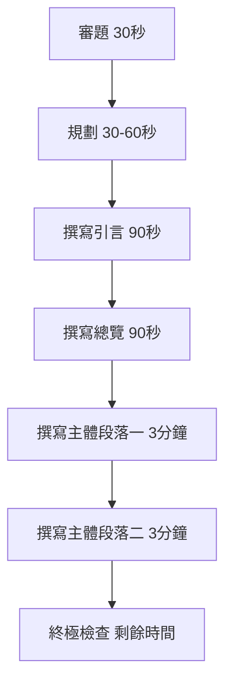
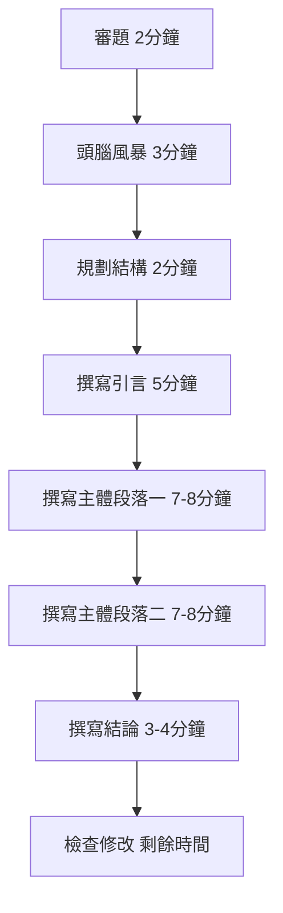

# 寫作學習中心 ✍️

歡迎來到寫作學習中心！本頁面提供 IELTS 寫作考試的全面指南、策略資源和練習記錄，幫助您提高寫作技巧並獲得理想分數。

## 📊 Task 1 - 圖表寫作

IELTS Academic 寫作的第一個任務要求您描述圖表、圖形、表格或流程圖。以下是幫助您掌握 Task 1 的資源：

### 策略資源

- [寫作流程與結構指南](Task_1/1_strategy/structure_and_pipeline.html) - 完整的 Task 1 寫作流程和結構指南
- [比較短語彙總](Task_1/1_strategy/comparison_phrases.html) - 描述數據變化和趨勢的有用表達
- [詞彙表](Task_1/1_strategy/vocabulary_master_sheet.html) - Task 1 寫作必備詞彙和句型庫

### 練習記錄

- [餅圖分析 (2023-10-20)](Task_1/2_practice_log/2023-10-20_Pie-Chart-Analysis.html) - 社交媒體使用者年齡分佈分析
- [柱狀圖分析 (2023-10-15)](Task_1/2_practice_log/2023-10-15_Bar-Chart-Analysis.html) - 城市人口變化分析
- [線圖練習 (2025-08-13)](Task_1/2_practice_log/2025-08-13_Line-Chart-Practice.html) - 線圖寫作練習
- [地圖練習 (2025-08-16)](Task_1/2_practice_log/2025-08-16_Maps-Practice.html) - 地圖變化描述練習

### 錯誤分析

- [常見錯誤筆記](Task_1/3_error_notebook/common_errors.html) - Task 1 寫作中的常見錯誤和改進方法

## 📝 Task 2 - 議論文寫作

IELTS 寫作的第二個任務要求您就給定主題撰寫議論文。以下資源將幫助您提高 Task 2 的寫作能力：

### 策略資源

- [文章結構指南](Task_2/1_strategy/essay_structures.html) - 適用於各種 Task 2 題型的文章結構
- [論點庫](Task_2/1_strategy/argument_bank.html) - 常見 IELTS 話題的論點和支持論據

### 練習記錄

- [體能運動議論文 (2023)](Task_2/2_practice_log/2023-physical-exercise-essay-errors.html) - 關於體育運動的議論文及錯誤分析
- [討論型議論文 (2025-08-18)](Task_2/2_practice_log/2025-08-18_Discussion-Essay-Practice.html) - 討論型議論文練習
- [問題與解決方案論文 (2025-08-26)](Task_2/2_practice_log/2025-08-26-Problem%20and%20Solution%20Topics.html) - 問題與解決方案型議論文練習

### 錯誤分析

- [常見錯誤筆記](Task_2/3_error_notebook/common_errors.html) - Task 2 寫作中的常見錯誤和改進方法
- [句子控制記錄](Task_2/3_error_notebook/sentence_control_log.html) - 改進句子結構和控制複雜度的筆記

## 🎯 寫作策略

### Task 1 基本策略

### Task 2 基本策略

## 📈 評分標準

IELTS 寫作考試根據四個標準評分：

| 評分標準                                              | Task 1 重點                          | Task 2 重點                                            |
| ----------------------------------------------------- | ------------------------------------ | ------------------------------------------------------ |
| **任務回應 (Task Achievement/Response)**              | 準確描述圖表主要特徵，包括趨勢和比較 | 完全回應所有題目要求，立場清晰，觀點全面發展           |
| **連貫與銜接 (Coherence & Cohesion)**                 | 邏輯組織段落，使用合適的連接詞       | 清晰的段落結構，連貫的論點發展，恰當使用指代詞和連接詞 |
| **詞彙資源 (Lexical Resource)**                       | 使用多樣的詞彙描述數據和趨勢         | 豐富多樣的詞彙，精確和靈活的用詞                       |
| **語法多樣性與準確性 (Grammatical Range & Accuracy)** | 正確使用各種句型，控制語法錯誤       | 靈活使用複雜句型，保持語法準確性                       |

## 🔍 常見問題

### 如何改進詞彙多樣性？

建立詞彙筆記本，將常見表達分類整理。例如，「增加」可以用 rise, increase, grow, surge, soar 等表達。練習時有意識地使用不同表達方式。

### 如何提高寫作速度？

定期進行限時練習，熟悉各種題型的寫作流程。開發個人的寫作模板，但避免使用過於機械的套路。

### 如何避免跑題？

仔細審題，識別題目的所有要求。在規劃階段確保覆蓋所有要點，寫作時定期檢查是否緊扣題目。

---

_持續練習和分析自己的寫作是提高分數的關鍵！_ 📝✨
