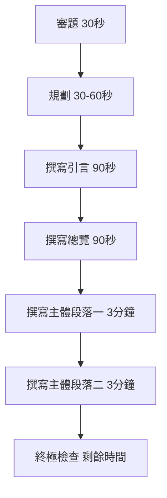
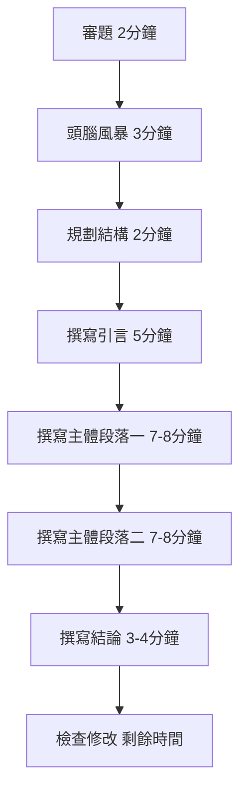

# 寫作學習中心 ✍️

歡迎來到寫作學習中心！本頁面提供 IELTS 寫作考試的全面指南、策略資源和練習記錄，幫助您提高寫作技巧並獲得理想分數。

## 📊 Task 1 - 圖表寫作

IELTS Academic 寫作的第一個任務要求您描述圖表、圖形、表格或流程圖。以下是幫助您掌握 Task 1 的資源：

### 策略資源

- [寫作流程與結構指南](Task_1/1_strategy/structure_and_pipeline.html) - 完整的 Task 1/reviews/1-20_pipe-structure_guide.html) - 完整的 Task 1 寫作流程和結構指南
- [比較短語彙總](Task_1/1_strategy/comparison_phrases.html) - 描述數據變化和趨勢的有用表達
- [詞彙表](Task_1/1_strategy/vocabulary_master_sheet.html) - Task 1 寫作必備詞彙和句型庫

### 練習記錄

- [餅圖分析 (2023-10-20)](Task_1/2_practice_log/2023-10-20_Pie-Chart-Analysis.html) - 社交媒體使用者年齡分佈分析
- [柱狀圖分析 (2023-10-15)](Task_1/2_practice_log/2023-10-15_Bar-Chart-Analysis.html) - 城市人口變化分析
- [線圖練習 (2025-08-13)](Task_1/2_practice_log/2025-08-13_Line-Chart-Practice.html) - 線圖寫作練習
- [地圖練習 (2025-08-16)](Task_1/2_practice_log/2025-08-16_Maps-Practice.html) - 地圖變化描述練習

### 錯誤分析

- [常見錯誤筆記](Task_1/3_error_notebook/common_errors.html) - Task 1 寫作中的常見錯誤和改進方法

## 📝 Task 2 - 議論文寫作

IELTS 寫作的第二個任務要求您就給定主題撰寫議論文。以下資源將幫助您提高 Task 2 的寫作能力：

### 策略資源

- [文章結構指南](Task_2/1_strategy/essay_structures.html) - 適用於各種 Task 2 題型的文章結構
- [論點库](Task_2/1_strategy/argument_bank.html) - 常見 IELTS 话题的论点和支持论据

### 練習記錄

- [體能運動議論文 (2023)](Task_2/2_practice_log/2023-physical-exercise-essay-errors.html) - 關於體育運動的議論文及錯誤分析
- [討論型議論文 (2025-08-18)](Task_2/2_practice_log/2025-08-18_Discussion-Essay-Practice.html) - 討論型議論文練習
- [問題與解決方案論文 (2025-08-26)](Task_2/2_practice_log/2025-08-26-Problem%20and%20Solution%20Topics.html) - 問題與解決方案型議論文練習

### 錯誤分析

- [常見錯誤筆記](Task_2/3_error_notebook/common_errors.html) - Task 2 寫作中的常見錯誤和改進方法
- [句子控制記錄](Task_2/3_error_notebook/sentence_control_log.html) - 改進句子结构和控制複雜度的筆記

## 🎯 寫作策略

### Task 1 基本策略

```mermaid
flowchart TD
    A[審題 30秒] --> B[規劃 30-60秒]
    B --> C[撰寫引言 90秒]
    C --> D[撰寫總覽 90秒]
    D --> E[撰寫主體段落一 3分鐘]
    E --> F[撰寫主體段落二 3分鐘]
    F --> G[終極檢查 剩餘時間]
```

### Task 2 基本策略

```mermaid
flowchart TD
    A[審題 2分鐘] --> B[頭腦風暴 3分鐘]
    B --> C[規劃結構 2分鐘]
    C --> D[撰寫引言 5分鐘]
    D --> E[撰寫主體段落一 7-8分鐘]
    E --> F[撰寫主體段落二 7-8分鐘]
    F --> G[撰寫結論 3-4分鐘]
    G --> H[檢查修改 剩餘時間]
```

## 📊 整體錯誤分析

| 緊急程度    | 錯誤類型         | 具體錯誤                          | ❌ 常見錯誤範例                                                                                                                                                                               | ✅ 修正與規則                                                                                                                                                                                                                                                     | 頻率      |
| ----------- | ---------------- | --------------------------------- | --------------------------------------------------------------------------------------------------------------------------------------------------------------------------------------------- | ----------------------------------------------------------------------------------------------------------------------------------------------------------------------------------------------------------------------------------------------------------------- | --------- |
| 🔴 Critical | Grammar          | Sentence Fragment                 | "Which may result in... By which, they saved... Showing major influence... Results in new food type..."                                                                           | "Attach the clause to the previous sentence with a comma. e.g., ...their assets are untraceable, which can deeply infect...  **Rule: The "Train Hook."** Which and -ing clauses are train cars, not engines. They must be hooked to a main sentence." | Very High |
| 🔴 Critical | Task Achievement | Data Misinterpretation            | "- Misreading the Y-Axis (e.g., "Number" vs. "Percentage") - Confusing lines on a graph (e.g., Philippines vs. Indonesia) - Assuming total numbers increased from a percentage chart" | "**Rule: The "Chart ID Card."** Before writing, you MUST confirm the Topic, Unit, and Time/Categories of the chart."                                                                                                                                              | Medium    |
| 🔴 Critical | Cohesion         | Incorrect Essay Structure         | "- Using a 5-paragraph structure with a separate "Overall" in Task 2 - Using a single body paragraph for a long Task 1 process"                                                           | "**Rule:** Task 2 is four paragraphs (Intro, B1, B2, Con). Task 1 process diagrams should be split into two body paragraphs for clarity."                                                                                                                         | Medium    |
| 🟡 High     | Task Achievement | Calculation & Fact Errors         | "- Incorrect math (e.g., 4.6x vs. 7x) - Incorrect dates/names (e.g., 1900 vs. 1990; Dolly vs. Dorothy)"                                                                                   | "**Rule: Trust, but Verify.** Your analysis is great, but you must double-check any number you calculate or fact you state."                                                                                                                                      | High      |
| 🟡 High     | Grammar          | "Monster" Sentences               | Writing single sentences over 40-50 words that contain multiple, loosely connected ideas                                                                                                      | "**Rule: The "25-Word Max Iron Law."** Break complex ideas into shorter, clearer sentences."                                                                                                                                                                      | High      |
| 🟡 High     | Vocabulary       | Persistent Spelling/Choice Errors | "- Cooper vs. Copper - colleges vs. colleagues - it's vs. its - amount vs. number"                                                                                                | These must be memorized and added to your proofreading checklist.                                                                                                                                                                                                 | Very High |

## 🔍 語法錯誤總結

#### 🔴 Critical - 句子片段 (Sentence Fragment)

**錯誤範例：**
- "Which may result in..."
- "By which, they saved..."
- "Showing major influence..."
- "Results in new food type..."

**修正方法：**
- **Rule: The "Train Hook"** - Which and -ing clauses are train cars, not engines
- They must be hooked to a main sentence with a comma
- Example: "...their assets are untraceable, which can deeply infect..."

#### 🔴 Critical - "怪物句子" (Monster Sentences)

**問題：** Writing single sentences over 40-50 words that combine too many loosely connected ideas

**解決方案：** 
- **Rule: The "25-Word Iron Law"** - Break complex ideas into 2-3 shorter, clearer sentences
- This is your most important discipline for improving clarity and accuracy

#### 🟡 High - 被動語態錯誤 (Incorrect Passive Voice)

**錯誤範例：**
- "...was accounted for..." (accounted for is active)
- "will be shift to..." (missing past particulate)
- "...and being sent to..." (incorrect form)

**修正：**
- Remember: passive requires "be + past participle"
- Examples: "will be shifted", "are sent"
- **Rule:** Memorize correct patterns for common Task 1 verbs

---

## 📝 拼寫錯誤摘要

### 🔴 Critical 錯誤（最高優先級）

| 錯誤單詞 | 正確拼寫 | 規則說明 |
|----------|----------|----------|
| colleges | colleagues | College 是教育場所；colleagues 是同事 |
| it's (所有格) | its | it's 永遠只表示 it is；所有格不加撇號 |
| cooperations | corporations | Cooperation = 合作；corporation = 企業 |

### 🟡 High 錯誤（高優先級）

| 錯誤類型 | 常見錯誤範例 | 正確拼寫 |
|----------|--------------|----------|
| 重複字母 | extremelly, efficent | extremely, efficient |
| 單詞組合 | through out, new built | throughout, newly built |
| 詞性混淆 | can recovered, loss motivations | can recover, lose momentum |

### 📊 錯誤頻率統計

- **Very High Frequency (🔥)**: Sentence fragments, "Monster" sentences
- **High Frequency (⭐)**: Passive voice errors, calculation mistakes  
- **Medium Frequency**: Spelling errors, verb form mistakes
- **Low Frequency**: Article usage, tense errors

---

## 📈 評分標準

IELTS 寫作考試根據四個標準評分：

| 評分標準                                              | Task 1 重點                          | Task 2 重點                                            |
| ----------------------------------------------------- | ------------------------------------ | -------------------:---------- |
| **任務回應 (Task Achievement/Response)**              | 準確描述圖表主要特徵，包括趨勢和比較 | 完全回應所有題目要求，立場清晰，觀點全面發展           |
| **連貫與銜接 (Coherence & Cohesion)**                 | 邏輯組織段落，使用合適的連接詞       | 清晰的段落結構，連貫的論點發展，恰當使用指代詞和連接詞 |
| **詞彙資源 (Lexical Resource)**                       | 使用多樣的詞彙描述數據和趨勢         | 豐富多樣的詞彙，精確和靈活的用詞                       |
| **語法多樣性與準確性 (Grammatical Range & Accuracy)** | 正確使用各種句型，控制語法錯誤       | 靈活使用複雜句型，保持語法準確性                       |

## 🔍 常見問題

### 如何改進詞彙多樣性？

建立詞匯筆記本，將常見表达分類整理。例如，「增加」可以用 rise, increase, grow, surge, soar 等表達。練習時有意識地使用不同表達方式。

### 如何提高寫作速度？

定期進行限時練習，熟悉各種題型的寫作流程。開發個人的寫作模板，但避免使用過於機械的套路。

### 如何避免跑題？

仔细審題，識別題目的所有要求。在規劃階段確保覆蓋所有要點，寫作時定期檢查是否緊扣題目。

---

_持續練習和分析自己的寫作是提高分數的關鍵！_ 📝✨