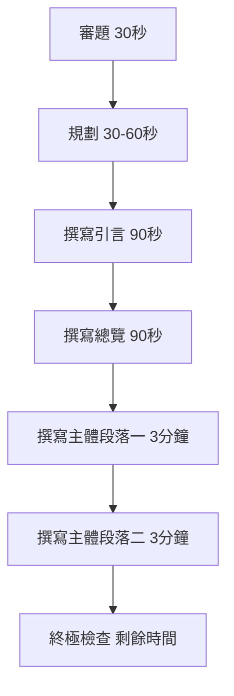
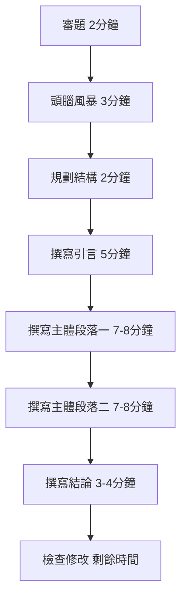

# 寫作學習中心 ✍️

歡迎來到寫作學習中心！本頁面提供 IELTS 寫作考試的全面指南、策略資源和練習記錄，幫助您提高寫作技巧並獲得理想分數。

## 📊 Task 1 - 圖表寫作

IELTS Academic 寫作的第一個任務要求您描述圖表、圖形、表格或流程圖。以下是幫助您掌握 Task 1 的資源：

### 策略資源

- [寫作流程與結構指南](Task_1/1_strategy/structure_and_pipeline.html) - 完整的 Task 1 寫作流程和結構指南
- [比較短語彙總](Task_1/1_strategy/comparison_phrases.html) - 描述數據變化和趨勢的有用表達
- [詞彙表](Task_1/1_strategy/vocabulary_master_sheet.html) - Task 1 寫作必備詞彙和句型庫

### 練習記錄

- [餅圖分析 (2023-10-20)](Task_1/2_practice_log/2023-10-20_Pie-Chart-Analysis.html) - 社交媒體使用者年齡分佈分析
- [柱狀圖分析 (2023-10-15)](Task_1/2_practice_log/2023-10-15_Bar-Chart-Analysis.html) - 城市人口變化分析
- [線圖練習 (2025-08-13)](Task_1/2_practice_log/2025-08-13_Line-Chart-Practice.html) - 線圖寫作練習
- [地圖練習 (2025-08-16)](Task_1/2_practice_log/2025-08-16_Maps-Practice.html) - 地圖變化描述練習

### 錯誤分析

- [常見錯誤筆記](Task_1/3_error_notebook/common_errors.html) - Task 1 寫作中的常見錯誤和改進方法

## 📝 Task 2 - 議論文寫作

IELTS 寫作的第二個任務要求您就給定主題撰寫議論文。以下資源將幫助您提高 Task 2 的寫作能力：

### 策略資源

- [文章結構指南](Task_2/1_strategy/essay_structures.html) - 適用於各種 Task 2 題型的文章結構
- [論點庫](Task_2/1_strategy/argument_bank.html) - 常見 IELTS 話題的論點和支持論據

### 練習記錄

- [體能運動議論文 (2023)](Task_2/2_practice_log/2023-physical-exercise-essay-errors.html) - 關於體育運動的議論文及錯誤分析
- [討論型議論文 (2025-08-18)](Task_2/2_practice_log/2025-08-18_Discussion-Essay-Practice.html) - 討論型議論文練習
- [問題與解決方案論文 (2025-08-26)](Task_2/2_practice_log/2025-08-26-Problem%20and%20Solution%20Topics.html) - 問題與解決方案型議論文練習

### 錯誤分析

- [常見錯誤筆記](Task_2/3_error_notebook/common_errors.html) - Task 2 寫作中的常見錯誤和改進方法
- [句子控制記錄](Task_2/3_error_notebook/sentence_control_log.html) - 改進句子結構和控制複雜度的筆記

## 🎯 寫作策略

### Task 1 基本策略

```mermaid
flowchart TD
    A[審題 30秒] --> B[規劃 30-60秒]
    B --> C[撰寫引言 90秒]
    C --> D[撰寫總覽 90秒]
    D --> E[撰寫主體段落一 3分鐘]
    E --> F[撰寫主體段落二 3分鐘]
    F --> G[終極檢查 剩餘時間]
```

### Task 2 基本策略

```mermaid
flowchart TD
    A[審題 2分鐘] --> B[頭腦風暴 3分鐘]
    B --> C[規劃結構 2分鐘]
    C --> D[撰寫引言 5分鐘]
    D --> E[撰寫主體段落一 7-8分鐘]
    E --> F[撰寫主體段落二 7-8分鐘]
    F --> G[撰寫結論 3-4分鐘]
    G --> H[檢查修改 剩餘時間]
```

## overall errors
Urgency	Error Category	Specific Error	❌ Your Common Mistake(s)	✅ Correction & Rule	Frequency		
🔴 Critical	Grammar	Sentence Fragment	"Which may result in...
By which, they saved...
Showing major influence...
Results in new food type..."	"Attach the clause to the previous sentence with a comma.
e.g., ...their assets are untraceable, which can deeply infect...

Rule: The ""Train Hook."" Which and -ing clauses are train cars, not engines. They must be hooked to a main sentence."	Very High		
🔴 Critical	Task Achievement	Data Misinterpretation	"- Misreading the Y-Axis (e.g., ""Number"" vs. ""Percentage"").
- Confusing lines on a graph (e.g., Philippines vs. Indonesia).
- Assuming total numbers increased from a percentage chart."	Rule: The "Chart ID Card." Before writing, you MUST confirm the Topic, Unit, and Time/Categories of the chart.	Medium		
🔴 Critical	Cohesion	Incorrect Essay Structure	"- Using a 5-paragraph structure with a separate ""Overall"" in Task 2.
- Using a single body paragraph for a long Task 1 process."	Rule: Task 2 is four paragraphs (Intro, B1, B2, Con). Task 1 process diagrams should be split into two body paragraphs for clarity.	Medium		
🟡 High	Task Achievement	Calculation & Fact Errors	"- Incorrect math (e.g., 4.6x vs. 7x).
- Incorrect dates/names (e.g., 1900 vs. 1990; Dolly vs. Dorothy)."	Rule: Trust, but Verify. Your analysis is great, but you must double-check any number you calculate or fact you state.	High		
🟡 High	Grammar	"Monster" Sentences	Writing single sentences over 40-50 words that contain multiple, loosely connected ideas.	Rule: The "25-Word Max Iron Law." Break complex ideas into shorter, clearer sentences.	High		
🟡 High	Vocabulary	Persistent Spelling/Choice Errors	"- Cooper vs. Copper
- colleges vs. colleagues
- it's vs. its
- amount vs. number"	These must be memorized and added to your proofreading checklist.	Very High		

## grammar error logs
Urgency	Error Category	Specific Error	❌ My Common Mistake (Example)	✅ The Fix (Correction & Rule)	Frequency																				
🔴 Critical	Sentence Structure	Sentence Fragment	"Which may result in... 
 By which, they saved... 
 Showing major influence... 
 Results in new food type..."	"Attach the clause to the previous sentence with a comma.
e.g., ...their assets are untraceable, which can deeply infect...

Rule: The ""Train Hook."" Which and -ing clauses are train cars, not engines. They must be hooked to a main sentence."	Very High																				
🔴 Critical	Sentence Structure	"Monster" Sentences	Writing single sentences over 40-50 words that combine too many loosely connected ideas, leading to confusion and errors.	"Break the idea into 2-3 shorter, clearer sentences.

Rule: The ""25-Word Iron Law."" This is your most important discipline for improving clarity and accuracy."	High																				
🟡 High	Grammar Pattern	Incorrect Passive Voice	"...was accounted for...
will be shift to...
...and being sent to..."	"- accounted for is an active verb.
- The passive requires be + past participle (e.g., will be shifted, are sent).

Rule: Memorize the correct patterns for common Task 1 verbs."	Medium																				
🟡 High	Grammar	Subject-Verb Agreement	"the reason... were due to...
users... was accounted for...
the area... were constructed...
new apartments has been constructed..."	"the reason... was...
users... accounted for...
the area... was...
new apartments have been...

Rule: Ensure the verb matches its subject, especially with plural subjects or when the subject is far from the verb."	Medium																				
🟢 Medium	Grammar	Incorrect Verb Forms	"cannot be remove
had exceed
keep rising (in past context)
instead of went"	"cannot be removed
had exceeded
kept rising
instead of going

Rule: Check passive forms, past participles, and verb tenses."	Medium																				
🔴 Critical	Sentence Structure	Sentence Fragment	"Which may result in... 
 By which, they saved... 
 Showing major influence... 
 Resulting in new food type..."	"Attach the clause to the previous sentence with a comma.
e.g., ...their assets are untraceable, which can deeply infect...

Rule: The ""Train Hook."" Which and -ing clauses are train cars, not engines. They must be hooked to a main sentence."	Very High																				
🔴 Critical	Sentence Structure	"Monster" Sentences	Writing single sentences over 40-50 words that combine too many loosely connected ideas, leading to confusion and errors.	"Break the idea into 2-3 shorter, clearer sentences.

Rule: The ""25-Word Iron Law."" This is your most important discipline for improving clarity and accuracy."	High																				
🟡 High	Grammar Pattern	Incorrect Passive Voice	"...was accounted for...
will be shift to...
...and being sent to..."	"- accounted for is an active verb.
- The passive requires be + past participle (e.g., will be shifted, are sent).

Rule: Memorize the correct patterns for common Task 1 verbs."	Medium																				
🟡 High	Grammar	Subject-Verb Agreement	"the reason... were due to...
users... was accounted for...
the area... were constructed...
new apartments has been constructed..."	"the reason... was...
users... accounted for...
the area... was...
new apartments have been...

Rule: Ensure the verb matches its subject (singular vs. plural), especially when the subject is far from the verb."	Medium																				
🟢 Medium	Grammar	Incorrect Verb Forms	"cannot be remove
had exceed
keep rising (in past context)
instead of went"	"cannot be removed
had exceeded
kept rising
instead of going

Rule: Check passive forms, past participles, and verb tenses."	Medium																				
🟢 Medium	Grammar	Article Usage	spend great amount of time...	"spend **a** great amount of time...

Rule: Pay attention to the use of a/an/the, especially with common nouns."	Low																				
🟢 Medium	Grammar	Incorrect Tense	Using the present tense to describe a past event on a map (there some houses...).	"there **were** some houses...

Rule: When describing a map from a past year (e.g., 1986), use the past simple tense."	Low																				
🔴 Critical	Sentence Structure	Sentence Fragment	"Which may result in... 
 By which, they saved... 
 Showing major influence... 
 Resulting in new food type..."	"Attach the clause to the previous sentence with a comma.
e.g., ...their assets are untraceable, which can deeply infect...

Rule: The ""Train Hook."" Which and -ing clauses are train cars, not engines. They must be hooked to a main sentence."	Very High																				
🔴 Critical	Sentence Structure	"Monster" Sentences	Writing single sentences over 40-50 words that combine too many loosely connected ideas, leading to confusion and errors.	"Break the idea into 2-3 shorter, clearer sentences.

Rule: The ""25-Word Iron Law."" This is your most important discipline for improving clarity and accuracy."	High																				
🟡 High	Grammar Pattern	Incorrect Passive Voice	"...was accounted for...
will be shift to...
...and being sent to..."	"- accounted for is an active verb.
- The passive requires be + past participle (e.g., will be shifted, are sent).

Rule: Memorize the correct patterns for common Task 1 verbs."	Medium																				
🟡 High	Grammar	Subject-Verb Agreement	"the reason... were due to...
users... was accounted for...
the area... were constructed...
new apartments has been constructed..."	"the reason... was...
users... accounted for...
the area... was...
new apartments have been...

Rule: Ensure the verb matches its subject (singular vs. plural), especially when the subject is far from the verb."	Medium																				
🟢 Medium	Grammar	Incorrect Verb Forms	"cannot be remove
had exceed
keep rising (in past context)
instead of went"	"cannot be removed
had exceeded
kept rising
instead of going

Rule: Check passive forms, past participles, and verb tenses."	Medium																				
🟢 Medium	Grammar	Article Usage	spend great amount of time...	"spend **a** great amount of time...

Rule: Pay attention to the use of a/an/the, especially with common nouns."	Low																				
🟢 Medium	Grammar	Incorrect Tense	Using the present tense to describe a past event on a map (there some houses...).	"there **were** some houses...

Rule: When describing a map from a past year (e.g., 1986), use the past simple tense."	Low																				
___
## spelling errors
Date	Error Type	❌ My Error (Example)	✅ The Fix (Correction & Rule)	Urgency	Frequency
Frequent	Persistent Spelling	colleges	"colleagues (同事)

Rule: ""College"" is a place of education. ""Colleagues"" are people you work with."	🔴 Critical	High
2025-09-06	Persistent Spelling	it's (for possessive)	"its (所有格)

Rule: It's only ever means it is. The possessive form has no apostrophe."	🔴 Critical	High
2025-09-03	Persistent Spelling	cooperations	"corporations (企業)

Rule: A common false friend. ""Cooperation"" means working together; ""corporation"" is a business."	🔴 Critical	Medium
2025-08-15	Spelling	atractive	attractive	🟡 High	Medium
2025-08-18	Spelling	fist	first	🟡 High	Low
2025-08-18	Spelling	soar (for pain)	"sore (痠痛)

Rule: Sore is for pain; soar is to fly high."	🟡 High	Low
2025-08-19	Spelling	govenment	government	🟡 High	Medium
2025-08-19	Spelling	efficent	efficient	🟡 High	Medium
2025-08-16	Spelling	woking	working	🟢 Medium	Low
2025-08-15	Word Form	gaming addition	"gaming addiction (成癮)

Rule: Use the correct noun form for the concept."	🔴 Critical	Low
2025-08-16	Word Form	loosing	losing	🟢 Medium	Low
2025-08-21	Word Form	can recovered	"can recover

Rule: After a modal verb (can, should, will), use the base form of the verb."	🟡 High	High
2025-08-17	Word Form	loss motivations	"lose motivation

Rule: Loss is a noun; lose is the verb."	🟢 Medium	Medium
2025-08-27	Word Form	fleshing	fresh	🟢 Medium	Low
Date	Error Type	❌ My Error (Example)	✅ The Fix (Correction & Rule)	Urgency	Frequency
Frequent	Persistent Spelling	cooperations	"corporations (企業)

Rule: A common false friend. ""Cooperation"" means working together; ""corporation"" is a business."	🔴 Critical	High
Frequent	Persistent Spelling	colleges	"colleagues (同事)

Rule: ""College"" is a place of education. ""Colleagues"" are people you work with."	🔴 Critical	High
Frequent	Persistent Spelling	it's (for possessive)	"its (所有格)

Rule: It's only ever means it is. The possessive form has no apostrophe."	🔴 Critical	High
2025-09-21	Spelling	extremelly	extremely	🟡 High	Medium
2025-09-11	Spelling	populaution	population	🟡 High	Medium
2025-09-11	Spelling	largestest	largest	🟡 High	Medium
2025-09-25	Spelling	dessert	"desert (沙漠)

Rule: Dessert has two 's' because you always want more."	🟡 High	Low
2025-09-21	Word Form	prisoning	"imprisonment (監禁)

Rule: Use the correct noun form for the concept."	🟢 Medium	Low
2025-09-21	Word Choice	gun fires	"firearms (槍支)

Rule: ""Firearms"" is the more precise and common term for weapons."	🟢 Medium	Low
2025-09-25	Spelling	disastrs	disasters	🟢 Medium	Low
2025-09-25	Spelling	accomodations	accommodations	🟢 Medium	Low
2025-09-17	Spelling	inconvinent	inconvenient	🟢 Medium	Low
2025-09-16	Spelling	lasly	lastly	🟢 Medium	Low
2025-09-13	Spelling	tripple	triple	🟢 Medium	Low
2025-09-13	Spelling	through out	throughout	🟢 Medium	Low
2025-08-31	Spelling	material arts	martial arts	🟡 High	Low
2025-08-28	Spelling	inrational	irrational	🟡 High	Low
2025-08-25	Word Form	new built	"newly built

Rule: Use the adverb newly to modify the adjective built."	🟢 Medium	Medium
2025-08-24	Word Form	soxes	socks	🟢 Medium	Low
2025-08-24	Word Form	spins / weaved	"yarn / woven

Rule: Spin creates yarn. Weave creates fabric. The past participle of weave is woven."	🟢 Medium	Low
2025-08-16	Word Form	graduated form	graduated from	🟢 Medium	Low
2025-08-15	Word Form	strategies thinking	strategic thinking	🟢 Medium	Low
2025-08-01	Word Form	Gooding	Good	🟢 Medium	Low
2025-10-01	Spelling	extremelly	extremely	🟡 High	Medium
2025-09-25	Spelling	accomodations	accommodations	🟢 Medium	Low
2025-09-25	Spelling	disastrs	disasters	🟢 Medium	Low
2025-09-25	Spelling	dessert	desert	🟡 High	Low
2025-09-25	Spelling	plumps	pumps	🟢 Medium	Low
2025-09-25	Spelling	specificly	specifically	🟢 Medium	Low
2025-09-23	Spelling	lasly	lastly	🟢 Medium	Low
2025-09-21	Spelling	inrational	irrational	🟡 High	Low
2025-09-17	Spelling	inconvinent	inconvenient	🟢 Medium	Low
2025-09-13	Spelling	tripple	triple	🟢 Medium	Low
2025-09-13	Spelling	through out	throughout	🟢 Medium	Low
2025-09-11	Spelling	populaution	population	🟡 High	Medium
2025-09-11	Spelling	largestest	largest	🟡 High	Medium
2025-09-08	Spelling	benificial	beneficial	🟡 High	Low
2025-09-08	Spelling	necesissty	necessity	🟡 High	Low
2025-09-08	Spelling	tenologies	technologies	🟡 High	Low
2025-09-08	Spelling	fussion	fusion	🟡 High	Low
2025-09-08	Spelling	drining palnet	draining our planet	🟡 High	Low
2025-09-08	Spelling	argriculture	agriculture	🟡 High	Low
2025-08-31	Spelling	material arts	martial arts	🟡 High	Low
2025-08-22	Spelling	woking	working	🟢 Medium	Low
2025-08-19	Spelling	govenment	government	🟡 High	Medium
2025-08-19	Spelling	efficent	efficient	🟡 High	Medium
2025-08-18	Spelling	fist	first	🟡 High	Low
2025-08-18	Spelling	soar (for pain)	sore	🟡 High	Low
2025-08-15	Spelling	atractive	attractive	🟢 Medium	Low
2025-09-21	Word Form	prisoning	imprisonment	🟢 Medium	Low
2025-09-21	Word Form	gun fires	firearms	🟢 Medium	Low
2025-09-17	Word Form	dis advantages	disadvantages	🟢 Medium	Low
2025-09-17	Word Form	lossing	losing	🟢 Medium	Medium
2025-09-07	Word Form	especial	especially	🟢 Medium	Low
2025-09-07	Word Form	fiats	fiat	🟢 Medium	Low
2025-08-27	Word Form	fleshing	fresh	🟢 Medium	Low
2025-08-25	Word Form	new built	newly built	🟢 Medium	Medium
2025-08-24	Word Form	soxes	socks	🟢 Medium	Low
2025-08-24	Word Form	spins / weaved	yarn / woven	🟢 Medium	Low
2025-08-22	Word Form	graduated form	graduated from	🟢 Medium	Low
2025-08-21	Word Form	can recovered	can recover	🟡 High	High
2025-08-17	Word Form	loss motivations	lose motivation	🟢 Medium	Medium
2025-08-16	Word Form	loosing	losing	🟢 Medium	Low
2025-08-15	Word Form	gaming addition	gaming addiction	🔴 Critical	Low
2025-08-15	Word Form	strategies thinking	strategic thinking	🟢 Medium	Low
2023-10-15	Word Form	Gooding	Good	🟢 Medium	Low
2025-10-01	Spelling	extremelly	extremely	🟡 High	Medium
2025-09-25	Spelling	accomodations	accommodations	🟢 Medium	Low
2025-09-25	Spelling	disastrs	disasters	🟢 Medium	Low
2025-09-25	Spelling	dessert	desert	🟡 High	Low
2025-09-25	Spelling	plumps	pumps	🟢 Medium	Low
2025-09-25	Spelling	specificly	specifically	🟢 Medium	Low
2025-09-23	Spelling	lasly	lastly	🟢 Medium	Low
2025-09-21	Spelling	inrational	irrational	🟡 High	Low
2025-09-17	Spelling	inconvinent	inconvenient	🟢 Medium	Low
2025-09-13	Spelling	tripple	triple	🟢 Medium	Low
2025-09-13	Spelling	through out	throughout	🟢 Medium	Low
2025-09-11	Spelling	populaution	population	🟡 High	Medium
2025-09-11	Spelling	largestest	largest	🟡 High	Medium
2025-09-08	Spelling	benificial	beneficial	🟡 High	Low
2025-09-08	Spelling	necesissty	necessity	🟡 High	Low
2025-09-08	Spelling	tenologies	technologies	🟡 High	Low
2025-09-08	Spelling	fussion	fusion	🟡 High	Low
2025-09-08	Spelling	argriculture	agriculture	🟡 High	Low
2025-09-06	Spelling	oftenly	often	🟢 Medium	High
2025-08-31	Spelling	material arts	martial arts	🟡 High	Low
2025-08-22	Spelling	woking	working	🟢 Medium	Low
2025-08-19	Spelling	govenment	government	🟡 High	Medium
2025-08-19	Spelling	efficent	efficient	🟡 High	Medium
2025-08-18	Spelling	fist	first	🟡 High	Low
2025-08-18	Spelling	soar (for pain)	sore	🟡 High	Low
2025-08-17	Spelling	pounds (for ponds)	ponds	🟢 Medium	Low
2025-08-15	Spelling	atractive	attractive	🟢 Medium	Low
2025-09-21	Word Form	prisoning	imprisonment	🟢 Medium	Low
2025-09-21	Word Form	gun fires	firearms	🟢 Medium	Low
2025-09-17	Word Form	dis advantages	disadvantages	🟢 Medium	Low
2025-09-17	Word Form	lossing	losing	🟢 Medium	Medium
2025-09-07	Word Form	especial	especially	🟢 Medium	Low
2025-09-07	Word Form	fiats	fiat	🟢 Medium	Low
2025-08-27	Word Form	fleshing	fresh	🟢 Medium	Low
2025-08-26	Word Form	complete removed	completely removed	🟢 Medium	Low
2025-08-25	Word Form	new built	newly built	🟢 Medium	Medium
2025-08-24	Word Form	soxes	socks	🟢 Medium	Low
2025-08-24	Word Form	spins / weaved	yarn / woven	🟢 Medium	Low
2025-08-22	Word Form	graduated form	graduated from	🟢 Medium	Low
2025-08-21	Word Form	can recovered	can recover	🟡 High	High
2025-08-17	Word Form	loss motivations	lose motivation	🟢 Medium	Medium
2025-08-16	Word Form	loosing	losing	🟢 Medium	Low
2025-08-16	Word Form	edge-cutting	cutting-edge	🟢 Medium	Low
2025-08-15	Word Form	gaming addition	gaming addiction	🔴 Critical	Low
2025-08-15	Word Form	strategies thinking	strategic thinking	🟢 Medium	Low
2023-10-15	Word Form	Gooding	Good	🟢 Medium	Low
2023-10-15	Word Form	Following by	Followed by	🟡 High	Low
2023-10-01	Word Form	thought (for teach)	taught	🟡 High	Low
2023-10-01	Word Form	nosies	noises	🟢 Medium	Low
2023-10-01	Word Form	to dead	to death	🟡 High	Low

													
																									
																		
___

## 📈 評分標準

IELTS 寫作考試根據四個標準評分：

| 評分標準                                              | Task 1 重點                          | Task 2 重點                                            |
| ----------------------------------------------------- | ------------------------------------ | ------------------------------------------------------ |
| **任務回應 (Task Achievement/Response)**              | 準確描述圖表主要特徵，包括趨勢和比較 | 完全回應所有題目要求，立場清晰，觀點全面發展           |
| **連貫與銜接 (Coherence & Cohesion)**                 | 邏輯組織段落，使用合適的連接詞       | 清晰的段落結構，連貫的論點發展，恰當使用指代詞和連接詞 |
| **詞彙資源 (Lexical Resource)**                       | 使用多樣的詞彙描述數據和趨勢         | 豐富多樣的詞彙，精確和靈活的用詞                       |
| **語法多樣性與準確性 (Grammatical Range & Accuracy)** | 正確使用各種句型，控制語法錯誤       | 靈活使用複雜句型，保持語法準確性                       |

## 🔍 常見問題

### 如何改進詞彙多樣性？

建立詞彙筆記本，將常見表達分類整理。例如，「增加」可以用 rise, increase, grow, surge, soar 等表達。練習時有意識地使用不同表達方式。

### 如何提高寫作速度？

定期進行限時練習，熟悉各種題型的寫作流程。開發個人的寫作模板，但避免使用過於機械的套路。

### 如何避免跑題？

仔細審題，識別題目的所有要求。在規劃階段確保覆蓋所有要點，寫作時定期檢查是否緊扣題目。

---

_持續練習和分析自己的寫作是提高分數的關鍵！_ 📝✨
