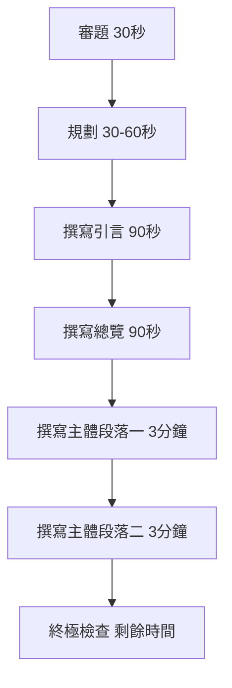
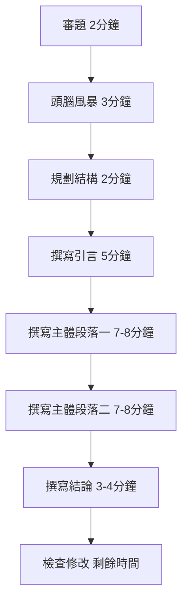

# 寫作學習中心 ✍️

歡迎來到寫作學習中心！本頁面提供 IELTS 寫作考試的全面指南、策略資源和練習記錄，幫助.提高寫作技巧並獲得理想分數。

## 📊 Task 1 - 圖表寫作

IELTS Academic 寫作的第一個任務要求.描述圖表、圖形、表格或流程圖。以下是幫助.掌握 Task 1 的資源：

### 策略資源

- [寫作流程與結構指南](Task_1/1_strategy/structure_and_pipeline.html) - 完整的 Task 1/reviews/1-20_pipe-structure_guide.html) - 完整的 Task 1 寫作流程和結構指南
- [比較短語彙總](Task_1/1_strategy/comparison_phrases.html) - 描述數據變化和趨勢的有用表達
- [詞彙表](Task_1/1_strategy/vocabulary_master_sheet.html) - Task 1 寫作必備詞彙和句型庫

### 練習記錄

- [餅圖分析 (2023-10-20)](Task_1/2_practice_log/2023-10-20_Pie-Chart-Analysis.html) - 社交媒體使用者年齡分佈分析
- [柱狀圖分析 (2023-10-15)](Task_1/2_practice_log/2023-10-15_Bar-Chart-Analysis.html) - 城市人口變化分析
- [線圖練習 (2025-08-13)](Task_1/2_practice_log/2025-08-13_Line-Chart-Practice.html) - 線圖寫作練習
- [地圖練習 (2025-08-16)](Task_1/2_practice_log/2025-08-16_Maps-Practice.html) - 地圖變化描述練習

|
## TTP - 2
### 關鍵的問題：「引言是否不一定要有三個句子？」

### 答案：完全不必。

### 目標是高效地完成 TTP 三個步驟，而不是刻意湊滿三句話。

### 以下是常見且高效的結構：

### 1. 「兩句式」引言 (最常見、最高效)
### - 這是最推薦的結構。
## *通常第一句完成 T+T (主題+任務)，第二句完成 P (立場)。*

- 範例 (利弊分析型):

- (Sentence 1 - T+T): The global trend of urban migration, driven by the pursuit of better employment, has raised questions about its overall impact on society. (Sentence 2 - P): In my view, the significant long-term disadvantages of this trend, such as strained public services, ultimately outweigh any short-term economic advantages.

### 2. 「三句式」引言 (清晰、穩健)
### 當題目背景比較複雜時，用三句話分開處理 T、T、P 也是一個非常好的選擇。

- 範例 (討論型):

- (Sentence 1 - T): The responsibility for maintaining public health is a contentious modern issue. (Sentence 2 - T): Some argue it is a matter of personal choice, while others contend that governments must play a leading role. (Sentence 3 - P): While individual accountability is important, I believe that governments hold the primary responsibility for creating a healthy society.

## 結論：

- 不要執著於三句話。 目標是寫出一個 40 到 60 個單詞、功能完整的引言。

-「兩句式」引言通常更簡潔有力，是大部分高分作文的選擇。

- 最重要的是，確保引言清晰地轉述了主題、點明了任務、並給出了明確的立場或大綱。完成了這三件事，無論是兩句還是三句，都是一個完美的引言。

|立場導向型 (Position-Oriented) | 結構預告型 (Structure-Foretelling)|
| :--- | :--- |
| 意見型 (Agree/Disagree) • 利弊分析型 (Advantages/Disadvantages) • 討論型 (Discuss Both Views) | • 原因與解決方案型 (Problem/Solution) • 雙問題型 (Two-Part Questions) |
 |"P":直接陳述觀點、判斷或傾向。 | "P":解釋essay結構和順序，不可在引言中提前給出具體的原因、方案或答案。|
  |補充: Discuss Both Views - 必須要提到兩邊(關鍵字:Some,others)跟個人傾向 (While I acknowledge... I am convinced that...)   Some argue that investing in the arts is crucial for a nation's cultural vitality. Conversely, others contend that this money should be prioritized for essential public services like healthcare and education.  While I acknowledge the value of the arts, I am convinced that fundamental services impacting daily well-being must take precedence.| |

| 題型 (Question Type) | "T" (主題) 處理方式 - Parapharse | "T" (任務) 處理方式 | "P" (立場) 處理公式 |
| :--- | :--- | :--- | :--- |
| 意見型 (Agree/Disagree)	| 表明立場	|Some people believe that with the rise of technology, teachers will no longer be needed... To what extent do you agree or disagree?	 | The integration of technology into the classroom has fundamentally altered the landscape of modern education. (科技與教室的整合已根本性地改變了現代教育的面貌。)	|This has sparked a significant debate about whether the role of the human teacher is becoming obsolete. (這引發了一場關於人類教師的角色是否正被淘汰的激烈辯論。)| 
| 利弊分析型 (Advantages/Disadvantages)	| 做出權衡	|...people moving from rural areas to large cities... Do the advantages of this trend outweigh the disadvantages?|	Urban migration, the large-scale movement of populations from the countryside to cities, has become a defining feature of the 21st century. (城市遷移，即人口從鄉村到城市的大規模流動，已成為21世紀的一個決定性特徵。)	|Consequently, it is crucial to assess whether the opportunities presented by this phenomenon are worth the significant social and environmental costs. (因此，評估此現象帶來的機遇是否值得付出巨大的社會與環境代價，是至關重要的。)| 
| 討論型 (Discuss Both Views)	| 呈現辯論 + 表態	|...individuals are responsible for their own health... Others argue that it is the government's duty... Discuss both these views...	|Achieving and maintaining public health is a primary goal for societies worldwide. (達成並維持公眾健康是全球社會的首要目標。)|	However, a contentious debate exists regarding whether the primary responsibility for this lies with individual citizens or with the state. (然而，關於此事的主要責任在於公民個人還是國家，存在著一個充滿爭議的辯論。)
| 原因與解決方案型 (Problem/Solution)	| 設定藍圖	|...people today live in a "throw-away" society... What are the causes of this phenomenon, and what solutions can be taken...?|	The modern 'throw-away' culture, characterized by rampant consumerism and excessive waste, is posing a severe threat to global environmental stability. (以猖獗的消費主義和過度浪費為特徵的現代「拋棄型」文化，正對全球環境穩定構成嚴重威脅。)|	Therefore, it is essential to understand the root causes of this issue in order to propose effective countermeasures. (因此，為了提出有效的對策，理解此問題的根本原因至關重要。)| 
| 雙問題型 (Two-Part Questions)	| 設定藍圖	|...many people enjoy watching foreign films... Why is this the case? Should governments provide financial support to the local film industry?|	The global film landscape has been transformed by the increasing popularity and accessibility of foreign movies. (全球電影版圖已被日益普及和易於接觸的外國電影所改變。)	|This phenomenon raises two important questions: what are the reasons behind this trend, and what is the role of government in supporting its domestic film industry? (此現象引出了兩個重要問題：此趨勢背後的原因是什麼，以及政府在支持其國內電影產業上應扮演何種角色？)| 

.的總結非常到位，完全抓住了不同題型在引言「P (立場)」部分的核心差異。.的理解是100% 正確的。

我來為.逐點確認並做個總結，讓這個觀念更加鞏固。

1. 關於「原因解決型」與「雙問題型」
.的總結：ttp,的p的部分其實就是first...then...(解釋essay structure)的固定格式

確認：完全正確。

這兩類題型我們可以稱之為**「結構預告型」或「任務導向型」。題目的指令非常明確（e.g., "What are the causes and solutions?", "What are the factors and is it realistic?"），考官期待在引言的結尾看到一個清晰的「路線圖 (Roadmap)」或「大綱句 (Outline Sentence)」**，告訴他.將如何依序完成這些任務。

P 的功能： 預告文章結構。

常用句式：

"This essay will first analyze... before proposing..."

"This essay will address these two questions in turn, starting with..."

2. 關於「討論型」
的總結：必須要提到兩邊(關鍵字:Some,others)跟個人傾向

確認：非常精準。

「討論型」題目的指令有兩個："Discuss both these views" 和 "give your own opinion"。一個高分的引言必須同時回應這兩個指令。

回應 "Discuss both views"： 在「T (任務)」部分，清晰地轉述對立的雙方觀點。使用 Some people argue... while others contend... 這樣的句式效果最好。

回應 "give your own opinion"： 在「P (立場)」部分，明確表達.自己的看法。這不是預告結構，而是直接表態。

3. 關於「其餘題型」(意見型 & 利弊分析型)
的總結：其餘題型沒有結構上的問題(多為文法改善)，另外我想確認其餘題型也不用first...then...(解釋essay structure)的固定格式?

確認：是的，.的理解完全正確。

「意見型 (Agree/Disagree)」和「利弊分析型 (Advantages/Disadvantages)」我們稱之為**「立場導向型」**。

### Para body 1 section  - cd1e(Concept,D(Deeper Concept),1E)

| 題型 (Question Type) | "C" (CONCEPT)  | "D" (Deeper Concept-拓展概念) | "1E" (1個範例說明以上兩個概念) |
| :--- | :--- | :--- | :--- |
| **意見型**   (Agree/Disagree) | 以同意為例:說明同意的主要理由| 以同意為例:說明同意的次要理由 | **1E：** 支持以上兩個概念的範例。 *(e.g., "For instance, medical institutions in Japan had proved that 'main concept',......and medical institutions in German also had evidence regarding 'Second concept' " * |
| **利弊分析型**   (Advantages/Disadvantages) | 有利的主要概念說明 | 有利的次要拓展概念說明。 | **1e：** 支持以上兩個概念的範例。 *(e.g., "It can increase enhance effiency largely for facilities via implementing....And, noteworthy, proper execution of ... can benefit mental health of employees in facilities.")* |
| **討論型**   (Discuss Both Views) |C (Concept): 深入闡述 Side 1 的主要論點。 | D (Deeper Concept): 進一步延伸或解釋 Side 1 的第二個論點。 |  **1e：** 支持以上兩個概念的範例。 *(e.g.,"For instance, ... can indeed raise people's awareness on caring issues.However, ... can also consume much resources of people, like time.")* |
| **原因與解決方案型**   (Problem/Solution) | 說明產生問題的主要理由| 拓寬產生問題的次要理由。 | **1e：** 支持以上兩個概念的範例。|
| **雙問題型**   (Two-Part Questions) | 問題一主要概念 | 問題一拓展概念 |**1e：** 支持以上兩個概念的範例。|

### Para body 2 section - cd1e(Concept,D(Deeper Concept),1E)

| 題型 (Question Type) | "C" (CONCEPT)  | "D" (Deeper Concept-拓展概念) | "1E" (1個範例說明以上兩個概念) |
| :--- | :--- | :--- | :--- |
| **意見型**   (Agree/Disagree) | 以同意為例:說明不同意反面的主要理由| 以同意為例:說明不同意反面的次要理由 | **1E：** 支持以上兩個理由的範例。 *(e.g., "For instance, medical institutions in Thailand had proved that 'antimain concept' was wrong,......and medical institutions in German also had evidence pointing out 'Second concept' need more reviews. " * |
| **利弊分析型**   (Advantages/Disadvantages) | 不利的主要概念說明 | 不利的次要拓展概念說明。 | **1e：** 支持以上兩個概念的範例。 *(e.g., "It can increase expenditure e for facilities implementing....And transferm these costs by increasing prices of produts selling to customers or reducing payments for their own employees.")* |
| **討論型**   (Discuss Both Views) |C (Concept): 深入闡述 Side 2 的主要論點。 | D (Deeper Concept): 進一步延伸或解釋 Side 2 的第二個論點。 | * **1e：** 支持以上兩個概念的範例。 *(e.g.,"For example, ... requires less resources as well as expenditures, so it will be more affordable for individuals to execute.But,unfortunately, it's effective ranges are very limited due to ... ")* |
| **原因與解決方案型**   (Problem/Solution) | C (Concept): 提出第一個解決方案，並解釋它如何運作、為何有效（此處可以包含它的好處）。| D (Deeper Concept): 提出第二個解決方案，並解釋其運作方式和有效性。 | **1e：** 舉一個例子說明這些方案在現實中如何被應用或可能帶來什麼結果。|
| **雙問題型**   (Two-Part Questions) | 問題二主要概念 | 問題二拓展概念 |**1e：** 支持以上兩個概念的範例。|

### Conclusion  section  - cd1e(Concept,D(Deeper Concept),1E)
| 題型 (Question Type) | 結論陳述 (Concluding Statement) - 總結立場與要點  | 延伸思考/建議 (Final Thought/Recommendation) | 
| :--- | :--- | :--- | 
| 意見型 (Agree/Disagree) | 	重申明確立場 (同意或反對)，並簡要概括 Body 1 和 Body 2 中提出的核心理由。 | 	根據立場，提出一個建議或對未來的預測。 (e.g., "Therefore, it is recommended that schools focus on integrating voluntary community service rather than making it compulsory.") | 
| 利弊分析型 (Advantages/Disadvantages)	| 再次陳述最終判斷 (利大於弊或弊大於利)，並簡單總結最重要的優點和缺點。| 提出一個建設性的建議，說明如何能「最大化其優點，同時最小化其缺點」。 (e.g., "To fully harness the benefits of this trend, measures must be taken to mitigate its potential drawbacks.") | 
|  討論型 (Discuss Both Views) | 	簡要總結雙方的主要觀點，然後清晰地重申最終看法 (傾向哪一方，或綜合觀點)。 | 	提出一個具有前瞻性的看法，或者一個可能調和雙方觀點的折衷方案。 (e.g., "Ultimately, a balanced approach that combines insights from both perspectives is likely to yield the best results.") | 
|  原因與解決方案型 (Problem/Solution) | 	簡要概括問題的主要成因，並再次強調解決方案是有效且必要的。 | 	發出一個呼籲或建議，強調採取行動的迫切性。 (e.g., "It is imperative that governments and individuals work collaboratively to implement these solutions before the problem escalates further.") | 
|  雙問題型 (Two-Part Questions)	分別簡潔地對第一個問題和第二個問題的回答。 | 	根據第*二*個問題的答案（通常更具前瞻性），提出一個最終的評論或看法。  (e.g., "Moving forward, the success of this initiative will depend heavily on public cooperation and governmental support.")| 

### 錯誤分析

- [常見錯誤筆記](Task_1/3_error_notebook/common_errors.html) - Task 1 寫作中的常見錯誤和改進方法
___
## Overall Errors

| Urgency     | Error Category   | Specific Error             | ❌ Your Common Mistake(s)                                                                 | ✅ Correction & Rule                                                                 | Frequency  |
|-------------|------------------|----------------------------|-------------------------------------------------------------------------------------------|-------------------------------------------------------------------------------------|------------|
| 🔴 Critical | Grammar         | Sentence Fragment         | Which may result in... By which, they saved... Showing major influence... Results in new food type... | Attach the clause to the previous sentence with a comma. e.g., ...their assets are untraceable, which can deeply infect... Rule: The "Train Hook." Which and -ing clauses are train cars, not engines. They must be hooked to a main sentence. | Very High |
| 🔴 Critical | Task Achievement| Data Misinterpretation    | - Misreading the Y-Axis (e.g., "Number" vs. "Percentage"). - Confusing lines on a graph (e.g., Philippines vs. Indonesia). - Assuming total numbers increased from a percentage chart. | Rule: The "Chart ID Card." Before writing, you MUST confirm the Topic, Unit, and Time/Categories of the chart. | Medium    |
| 🔴 Critical | Cohesion        | Incorrect Essay Structure | - Using a 5-paragraph structure with a separate "Overall" in Task 2. - Using a single body paragraph for a long Task 1 process. | Rule: Task 2 is four paragraphs (Intro, B1, B2, Con). Task 1 process diagrams should be split into two body paragraphs for clarity. | Medium    |
| 🟡 High    | Task Achievement| Calculation & Fact Errors | - Incorrect math (e.g., 4.6x vs. 7x). - Incorrect dates/names (e.g., 1900 vs. 1990; Dolly vs. Dorothy). | Rule: Trust, but Verify. Your analysis is great, but you must double-check any number you calculate or fact you state. | High      |
| 🟡 High    | Grammar         | "Monster" Sentences       | Writing single sentences over 40-50 words that contain multiple, loosely connected ideas. | Rule: The "25-Word Max Iron Law." Break complex ideas into shorter, clearer sentences. | High      |
| 🟡 High    | Vocabulary      | Persistent Spelling/Choice Errors | - Cooper vs. Copper - colleges vs. colleagues - it's vs. its - amount vs. number | These must be memorized and added to your proofreading checklist.               | Very High |

## Spelling Errors (Unique Entries)
| Date   | Error Type          | ❌ My Error (Example) | ✅ The Fix (Correction & Rule)                                                                 | Urgency     | Frequency |
|--------|---------------------|-----------------------|------------------------------------------------------------------------------------------------|-------------|-----------|
| Frequent | Persistent Spelling | colleges             | colleagues (同事) Rule: "College" is a place of education. "Colleagues" are people you work with. | 🔴 Critical | High     |
| Frequent | Persistent Spelling | it's (for possessive)| its (所有格) Rule: It's only ever means it is. The possessive form has no apostrophe.     | 🔴 Critical | High     |
| Frequent | Persistent Spelling | cooperations         | corporations (企業) Rule: A common false friend. "Cooperation" means working together; "corporation" is a business. | 🔴 Critical | High     |
| 45906  | Persistent Spelling | it's (for possessive)| its (所有格) Rule: It's only ever means it is. The possessive form has no apostrophe.     | 🔴 Critical | High     |
| 45903  | Persistent Spelling | cooperations         | corporations (企業) Rule: A common false friend. "Cooperation" means working together; "corporation" is a business. | 🔴 Critical | Medium   |
| 45884  | Spelling            | atractive            | attractive                                                                                     | 🟡 High    | Medium   |
| 45887  | Spelling            | fist                 | first                                                                                          | 🟡 High    | Low      |
| 45887  | Spelling            | soar (for pain)      | sore (痠痛) Rule: Sore is for pain; soar is to fly high.                                    | 🟡 High    | Low      |
| 45888  | Spelling            | govenment            | government                                                                                     | 🟡 High    | Medium   |
| 45888  | Spelling            | efficent             | efficient                                                                                      | 🟡 High    | Medium   |
| 45885  | Spelling            | woking               | working                                                                                        | 🟢 Medium  | Low      |
| 45921  | Spelling            | extremelly           | extremely                                                                                      | 🟡 High    | Medium   |
| 45911  | Spelling            | populaution          | population                                                                                     | 🟡 High    | Medium   |
| 45911  | Spelling            | largestest           | largest                                                                                        | 🟡 High    | Medium   |
| 45925  | Spelling            | dessert              | desert (沙漠) Rule: Dessert has two 's' because you always want more.                       | 🟡 High    | Low      |
| 45900  | Spelling            | material arts        | martial arts                                                                                   | 🟡 High    | Low      |
| 45897  | Spelling            | inrational           | irrational                                                                                     | 🟡 High    | Low      |
| 45908  | Spelling            | benificial           | beneficial                                                                                     | 🟡 High    | Low      |
| 45908  | Spelling            | necesissty           | necessity                                                                                      | 🟡 High    | Low      |
| 45908  | Spelling            | tenologies           | technologies                                                                                   | 🟡 High    | Low      |
| 45908  | Spelling            | fussion              | fusion                                                                                         | 🟡 High    | Low      |
| 45908  | Spelling            | drining palnet       | draining our planet                                                                            | 🟡 High    | Low      |
| 45908  | Spelling            | argriculture         | agriculture                                                                                    | 🟡 High    | Low      |
| 45906  | Spelling            | oftenly              | often                                                                                          | 🟢 Medium  | High     |
| 45886  | Spelling            | pounds (for ponds)   | ponds                                                                                          | 🟢 Medium  | Low      |
| 45925  | Spelling            | disastrs             | disasters                                                                                      | 🟢 Medium  | Low      |
| 45925  | Spelling            | accomodations        | accommodations                                                                                 | 🟢 Medium  | Low      |
| 45917  | Spelling            | inconvinent          | inconvenient                                                                                   | 🟢 Medium  | Low      |
| 45916  | Spelling            | lasly                | lastly                                                                                         | 🟢 Medium  | Low      |
| 45913  | Spelling            | tripple              | triple                                                                                         | 🟢 Medium  | Low      |
| 45913  | Spelling            | through out          | throughout                                                                                     | 🟢 Medium  | Low      |
| 45925  | Spelling            | plumps               | pumps                                                                                          | 🟢 Medium  | Low      |
| 45925  | Spelling            | specificly           | specifically                                                                                   | 🟢 Medium  | Low      |
| 45923  | Spelling            | lasly                | lastly                                                                                         | 🟢 Medium  | Low      |
| 45884  | Word Form           | gaming addition      | gaming addiction (成癮) Rule: Use the correct noun form for the concept.                    | 🔴 Critical | Low      |
| 45885  | Word Form           | loosing              | losing                                                                                         | 🟢 Medium  | Low      |
| 45890  | Word Form           | can recovered        | can recover Rule: After a modal verb (can, should, will), use the base form of the verb.   | 🟡 High    | High     |
| 45886  | Word Form           | loss motivations     | lose motivation Rule: Loss is a noun; lose is the verb.                                     | 🟢 Medium  | Medium   |
| 45896  | Word Form           | fleshing             | fresh                                                                                          | 🟢 Medium  | Low      |
| 45921  | Word Form           | prisoning            | imprisonment (監禁) Rule: Use the correct noun form for the concept.                        | 🟢 Medium  | Low      |
| 45921  | Word Choice         | gun fires            | firearms (槍支) Rule: "Firearms" is the more precise and common term for weapons.          | 🟢 Medium  | Low      |
| 45894  | Word Form           | new built            | newly built Rule: Use the adverb newly to modify the adjective built.                       | 🟢 Medium  | Medium   |
| 45893  | Word Form           | soxes                | socks                                                                                          | 🟢 Medium  | Low      |
| 45893  | Word Form           | spins / weaved       | yarn / woven Rule: Spin creates yarn. Weave creates fabric. The past participle of weave is woven. | 🟢 Medium  | Low      |
| 45885  | Word Form           | graduated form       | graduated from                                                                                 | 🟢 Medium  | Low      |
| 45884  | Word Form           | strategies thinking  | strategic thinking                                                                             | 🟢 Medium  | Low      |
| 45870  | Word Form           | Gooding              | Good                                                                                           | 🟢 Medium  | Low      |
| 45917  | Word Form           | dis advantages       | disadvantages                                                                                  | 🟢 Medium  | Low      |
| 45917  | Word Form           | lossing              | losing                                                                                         | 🟢 Medium  | Medium   |
| 45907  | Word Form           | especial             | especially                                                                                     | 🟢 Medium  | Low      |
| 45907  | Word Form           | fiats                | fiat                                                                                           | 🟢 Medium  | Low      |
| 45895  | Word Form           | complete removed     | completely removed                                                                             | 🟢 Medium  | Low      |
| 45885  | Word Form           | edge-cutting         | cutting-edge                                                                                   | 🟢 Medium  | Low      |
| 45214  | Word Form           | Gooding              | Good                                                                                           | 🟢 Medium  | Low      |
| 45214  | Word Form           | Following by         | Followed by                                                                                    | 🟡 High    | Low      |
| 45200  | Word Form           | thought (for teach)  | taught                                                                                         | 🟡 High    | Low      |
| 45200  | Word Form           | nosies               | noises                                                                                         | 🟢 Medium  | Low      |
| 45200  | Word Form           | to dead              | to death                                                                                       | 🟡 High    | Low      |
|        | Sentence Fragment   | Which can inevitably involved some guidelines or suggestions that will bnenefit themselves. | This can inevitably involve some guidelines... or ..., which can inevitably involve... Rule: The "Train Hook." Which is a "hook," not an "engine." It must be attached to the previous sentence with a comma. It cannot start a new sentence. |             |           |
|        | Sentence Fragment   | And which has made governments forced to be their proxy puppets. | This has made governments... or ..., which has made governments... Rule: The same "Train Hook" rule applies. And which is also incorrect as a sentence starter. |             |           |
|        | Subject-Verb Agreement | most of its member are... | most of its member**s** are... Rule: "Most of" is followed by a plural noun (members) and a plural verb (are). |             |           |
|        | Verb Form           | can inevitably involved | can inevitably involve Rule: After a modal verb (like can, will, should), always use the base form of the verb. |             |           |
|        | Redundancy          | the daily lives citizens | the daily lives **of** citizens Rule: Use the preposition "of" to show possession or relationship. |             |           |
|        | Spelling            | belive               | believe A common spelling mistake. Remember "i before e, except after c."                   |             |           |
|        | Spelling            | secrect              | secret Another common typo.                                                                 |             |           |
|        | Spelling            | vulnerbilities       | vulnerabilities Proofread carefully for transposed or missing letters in long words.        |             |           |
|        | Spelling            | bnenefit             | benefit A simple typo, likely from typing quickly.                                          |             |           |
|        | Word Form           | envolvementof        | involvement of "Involvement" is the correct noun form. Remember to add a space.             |             |           |
|        | Word Form           | constrainted         | constrained "Constrained" is the correct past participle form.                              |             |           |
|        | Word Form           | manage-level         | management-level "Management" is the correct noun used as an adjective here.               |             |           |
|        | Word Choice         | rely on              | reliance on The noun form "reliance" fits better in the sentence: "...governments' reliance on large private corporations..." |             |           |
|        | Word Choice         | use various aspects of products | use various products or rely on various products "Aspects of" is unnecessary and makes the phrase less direct. |             |           |
|        | Word Choice         | industrial big whales | industry giants or corporate titans "Big whales" is a very informal, translated metaphor. "Giants" or "titans" are more standard academic terms. |             |           |
|        | Word Choice         | full with jagors     | full of jargon "Jargon" is the correct term for specialized language, and the correct preposition is "of." |             |           |

## Grammar Errors (Unique Entries)
| Urgency     | Error Category   | Specific Error          | ❌ My Common Mistake (Example)                                                                 | ✅ The Fix (Correction & Rule)                                                                 | Frequency |
|-------------|------------------|-------------------------|------------------------------------------------------------------------------------------------|------------------------------------------------------------------------------------------------|-----------|
| 🔴 Critical | Sentence Structure | Sentence Fragment      | Which may result in...   By which, they saved...   Showing major influence...   Resulting in new food type... | Attach the clause to the previous sentence with a comma. e.g., ...their assets are untraceable, which can deeply infect... Rule: The "Train Hook." Which and -ing clauses are train cars, not engines. They must be hooked to a main sentence. | Very High |
| 🔴 Critical | Sentence Structure | "Monster" Sentences    | Writing single sentences over 40-50 words that combine too many loosely connected ideas, leading to confusion and errors. | Break the idea into 2-3 shorter, clearer sentences. Rule: The "25-Word Iron Law." This is your most important discipline for improving clarity and accuracy. | High     |
| 🟡 High    | Grammar Pattern  | Incorrect Passive Voice | ...was accounted for... will be shift to... ...and being sent to...                      | - accounted for is an active verb. - The passive requires be + past participle (e.g., will be shifted, are sent). Rule: Memorize the correct patterns for common Task 1 verbs. | Medium   |
| 🟡 High    | Grammar          | Subject-Verb Agreement | the reason... were due to... users... was accounted for... the area... were constructed... new apartments has been constructed... | the reason... was... users... accounted for... the area... was... new apartments have been... Rule: Ensure the verb matches its subject (singular vs. plural), especially when the subject is far from the verb. | Medium   |
| 🟢 Medium  | Grammar          | Incorrect Verb Forms   | cannot be remove had exceed keep rising (in past context) instead of went            | cannot be removed had exceeded kept rising instead of going Rule: Check passive forms, past participles, and verb tenses. | Medium   |
| 🟢 Medium  | Grammar          | Article Usage          | spend great amount of time...                                                                  | spend **a** great amount of time... Rule: Pay attention to the use of a/an/the, especially with common nouns. | Low      |
| 🟢 Medium  | Grammar          | Incorrect Tense        | Using the present tense to describe a past event on a map (there some houses...).              | there **were** some houses... Rule: When describing a map from a past year (e.g., 1986), use the past simple tense. | Low      |

___

---

## Overall Errors

| Urgency     | Error Category   | Specific Error                    | ❌ Your Common Mistake(s)                                                                                                                                                                    | ✅ Correction & Rule                                                                                                                                                                                                                                 | Frequency |
| ----------- | ---------------- | --------------------------------- | -------------------------------------------------------------------------------------------------------------------------------------------------------------------------------------------- | ---------------------------------------------------------------------------------------------------------------------------------------------------------------------------------------------------------------------------------------------------- | --------- |
| 🔴 Critical | Grammar          | Sentence Fragment                 | Which may result in... By which, they saved... Showing major influence... Results in new food type...                                                                               | Attach the clause to the previous sentence with a comma. e.g., ...their assets are untraceable, which can deeply infect... Rule: The "Train Hook." Which and -ing clauses are train cars, not engines. They must be hooked to a main sentence. | Very High |
| 🔴 Critical | Task Achievement | Data Misinterpretation            | - Misreading the Y-Axis (e.g., "Number" vs. "Percentage"). - Confusing lines on a graph (e.g., Philippines vs. Indonesia). - Assuming total numbers increased from a percentage chart. | Rule: The "Chart ID Card." Before writing, you MUST confirm the Topic, Unit, and Time/Categories of the chart.                                                                                                                                       | Medium    |
| 🔴 Critical | Cohesion         | Incorrect Essay Structure         | - Using a 5-paragraph structure with a separate "Overall" in Task 2. - Using a single body paragraph for a long Task 1 process.                                                           | Rule: Task 2 is four paragraphs (Intro, B1, B2, Con). Task 1 process diagrams should be split into two body paragraphs for clarity.                                                                                                                  | Medium    |
| 🟡 High     | Task Achievement | Calculation & Fact Errors         | - Incorrect math (e.g., 4.6x vs. 7x). - Incorrect dates/names (e.g., 1900 vs. 1990; Dolly vs. Dorothy).                                                                                   | Rule: Trust, but Verify. Your analysis is great, but you must double-check any number you calculate or fact you state.                                                                                                                               | High      |
| 🟡 High     | Grammar          | "Monster" Sentences               | Writing single sentences over 40-50 words that contain multiple, loosely connected ideas.                                                                                                    | Rule: The "25-Word Max Iron Law." Break complex ideas into shorter, clearer sentences.                                                                                                                                                               | High      |
| 🟡 High     | Vocabulary       | Persistent Spelling/Choice Errors | - Cooper vs. Copper - colleges vs. colleagues - it's vs. its - amount vs. number                                                                                                    | These must be memorized and added to your proofreading checklist.                                                                                                                                                                                    | Very High |

## Spelling Errors (Unique Entries)

| Date     | Error Type             | ❌ My Error (Example)                                                                       | ✅ The Fix (Correction & Rule)                                                                                                                                                                                                                   | Urgency     | Frequency |
| -------- | ---------------------- | ------------------------------------------------------------------------------------------- | ------------------------------------------------------------------------------------------------------------------------------------------------------------------------------------------------------------------------------------------------ | ----------- | --------- |
| Frequent | Persistent Spelling    | colleges                                                                                    | colleagues (同事) Rule: "College" is a place of education. "Colleagues" are people you work with.                                                                                                                                             | 🔴 Critical | High      |
| Frequent | Persistent Spelling    | it's (for possessive)                                                                       | its (所有格) Rule: It's only ever means it is. The possessive form has no apostrophe.                                                                                                                                                         | 🔴 Critical | High      |
| Frequent | Persistent Spelling    | cooperations                                                                                | corporations (企業) Rule: A common false friend. "Cooperation" means working together; "corporation" is a business.                                                                                                                           | 🔴 Critical | High      |
| 45906    | Persistent Spelling    | it's (for possessive)                                                                       | its (所有格) Rule: It's only ever means it is. The possessive form has no apostrophe.                                                                                                                                                         | 🔴 Critical | High      |
| 45903    | Persistent Spelling    | cooperations                                                                                | corporations (企業) Rule: A common false friend. "Cooperation" means working together; "corporation" is a business.                                                                                                                           | 🔴 Critical | Medium    |
| 45884    | Spelling               | atractive                                                                                   | attractive                                                                                                                                                                                                                                       | 🟡 High     | Medium    |
| 45887    | Spelling               | fist                                                                                        | first                                                                                                                                                                                                                                            | 🟡 High     | Low       |
| 45887    | Spelling               | soar (for pain)                                                                             | sore (痠痛) Rule: Sore is for pain; soar is to fly high.                                                                                                                                                                                      | 🟡 High     | Low       |
| 45888    | Spelling               | govenment                                                                                   | government                                                                                                                                                                                                                                       | 🟡 High     | Medium    |
| 45888    | Spelling               | efficent                                                                                    | efficient                                                                                                                                                                                                                                        | 🟡 High     | Medium    |
| 45885    | Spelling               | woking                                                                                      | working                                                                                                                                                                                                                                          | 🟢 Medium   | Low       |
| 45921    | Spelling               | extremelly                                                                                  | extremely                                                                                                                                                                                                                                        | 🟡 High     | Medium    |
| 45911    | Spelling               | populaution                                                                                 | population                                                                                                                                                                                                                                       | 🟡 High     | Medium    |
| 45911    | Spelling               | largestest                                                                                  | largest                                                                                                                                                                                                                                          | 🟡 High     | Medium    |
| 45925    | Spelling               | dessert                                                                                     | desert (沙漠) Rule: Dessert has two 's' because you always want more.                                                                                                                                                                         | 🟡 High     | Low       |
| 45900    | Spelling               | material arts                                                                               | martial arts                                                                                                                                                                                                                                     | 🟡 High     | Low       |
| 45897    | Spelling               | inrational                                                                                  | irrational                                                                                                                                                                                                                                       | 🟡 High     | Low       |
| 45908    | Spelling               | benificial                                                                                  | beneficial                                                                                                                                                                                                                                       | 🟡 High     | Low       |
| 45908    | Spelling               | necesissty                                                                                  | necessity                                                                                                                                                                                                                                        | 🟡 High     | Low       |
| 45908    | Spelling               | tenologies                                                                                  | technologies                                                                                                                                                                                                                                     | 🟡 High     | Low       |
| 45908    | Spelling               | fussion                                                                                     | fusion                                                                                                                                                                                                                                           | 🟡 High     | Low       |
| 45908    | Spelling               | drining palnet                                                                              | draining our planet                                                                                                                                                                                                                              | 🟡 High     | Low       |
| 45908    | Spelling               | argriculture                                                                                | agriculture                                                                                                                                                                                                                                      | 🟡 High     | Low       |
| 45906    | Spelling               | oftenly                                                                                     | often                                                                                                                                                                                                                                            | 🟢 Medium   | High      |
| 45886    | Spelling               | pounds (for ponds)                                                                          | ponds                                                                                                                                                                                                                                            | 🟢 Medium   | Low       |
| 45925    | Spelling               | disastrs                                                                                    | disasters                                                                                                                                                                                                                                        | 🟢 Medium   | Low       |
| 45925    | Spelling               | accomodations                                                                               | accommodations                                                                                                                                                                                                                                   | 🟢 Medium   | Low       |
| 45917    | Spelling               | inconvinent                                                                                 | inconvenient                                                                                                                                                                                                                                     | 🟢 Medium   | Low       |
| 45916    | Spelling               | lasly                                                                                       | lastly                                                                                                                                                                                                                                           | 🟢 Medium   | Low       |
| 45913    | Spelling               | tripple                                                                                     | triple                                                                                                                                                                                                                                           | 🟢 Medium   | Low       |
| 45913    | Spelling               | through out                                                                                 | throughout                                                                                                                                                                                                                                       | 🟢 Medium   | Low       |
| 45925    | Spelling               | plumps                                                                                      | pumps                                                                                                                                                                                                                                            | 🟢 Medium   | Low       |
| 45925    | Spelling               | specificly                                                                                  | specifically                                                                                                                                                                                                                                     | 🟢 Medium   | Low       |
| 45923    | Spelling               | lasly                                                                                       | lastly                                                                                                                                                                                                                                           | 🟢 Medium   | Low       |
| 45884    | Word Form              | gaming addition                                                                             | gaming addiction (成癮) Rule: Use the correct noun form for the concept.                                                                                                                                                                      | 🔴 Critical | Low       |
| 45885    | Word Form              | loosing                                                                                     | losing                                                                                                                                                                                                                                           | 🟢 Medium   | Low       |
| 45890    | Word Form              | can recovered                                                                               | can recover Rule: After a modal verb (can, should, will), use the base form of the verb.                                                                                                                                                      | 🟡 High     | High      |
| 45886    | Word Form              | loss motivations                                                                            | lose motivation Rule: Loss is a noun; lose is the verb.                                                                                                                                                                                       | 🟢 Medium   | Medium    |
| 45896    | Word Form              | fleshing                                                                                    | fresh                                                                                                                                                                                                                                            | 🟢 Medium   | Low       |
| 45921    | Word Form              | prisoning                                                                                   | imprisonment (監禁) Rule: Use the correct noun form for the concept.                                                                                                                                                                          | 🟢 Medium   | Low       |
| 45921    | Word Choice            | gun fires                                                                                   | firearms (槍支) Rule: "Firearms" is the more precise and common term for weapons.                                                                                                                                                             | 🟢 Medium   | Low       |
| 45894    | Word Form              | new built                                                                                   | newly built Rule: Use the adverb newly to modify the adjective built.                                                                                                                                                                         | 🟢 Medium   | Medium    |
| 45893    | Word Form              | soxes                                                                                       | socks                                                                                                                                                                                                                                            | 🟢 Medium   | Low       |
| 45893    | Word Form              | spins / weaved                                                                              | yarn / woven Rule: Spin creates yarn. Weave creates fabric. The past participle of weave is woven.                                                                                                                                            | 🟢 Medium   | Low       |
| 45885    | Word Form              | graduated form                                                                              | graduated from                                                                                                                                                                                                                                   | 🟢 Medium   | Low       |
| 45884    | Word Form              | strategies thinking                                                                         | strategic thinking                                                                                                                                                                                                                               | 🟢 Medium   | Low       |
| 45870    | Word Form              | Gooding                                                                                     | Good                                                                                                                                                                                                                                             | 🟢 Medium   | Low       |
| 45917    | Word Form              | dis advantages                                                                              | disadvantages                                                                                                                                                                                                                                    | 🟢 Medium   | Low       |
| 45917    | Word Form              | lossing                                                                                     | losing                                                                                                                                                                                                                                           | 🟢 Medium   | Medium    |
| 45907    | Word Form              | especial                                                                                    | especially                                                                                                                                                                                                                                       | 🟢 Medium   | Low       |
| 45907    | Word Form              | fiats                                                                                       | fiat                                                                                                                                                                                                                                             | 🟢 Medium   | Low       |
| 45895    | Word Form              | complete removed                                                                            | completely removed                                                                                                                                                                                                                               | 🟢 Medium   | Low       |
| 45885    | Word Form              | edge-cutting                                                                                | cutting-edge                                                                                                                                                                                                                                     | 🟢 Medium   | Low       |
| 45214    | Word Form              | Gooding                                                                                     | Good                                                                                                                                                                                                                                             | 🟢 Medium   | Low       |
| 45214    | Word Form              | Following by                                                                                | Followed by                                                                                                                                                                                                                                      | 🟡 High     | Low       |
| 45200    | Word Form              | thought (for teach)                                                                         | taught                                                                                                                                                                                                                                           | 🟡 High     | Low       |
| 45200    | Word Form              | nosies                                                                                      | noises                                                                                                                                                                                                                                           | 🟢 Medium   | Low       |
| 45200    | Word Form              | to dead                                                                                     | to death                                                                                                                                                                                                                                         | 🟡 High     | Low       |
|          | Sentence Fragment      | Which can inevitably involved some guidelines or suggestions that will bnenefit themselves. | This can inevitably involve some guidelines... or ..., which can inevitably involve... Rule: The "Train Hook." Which is a "hook," not an "engine." It must be attached to the previous sentence with a comma. It cannot start a new sentence. |             |           |
|          | Sentence Fragment      | And which has made governments forced to be their proxy puppets.                            | This has made governments... or ..., which has made governments... Rule: The same "Train Hook" rule applies. And which is also incorrect as a sentence starter.                                                                               |             |           |
|          | Subject-Verb Agreement | most of its member are...                                                                   | most of its member**s** are... Rule: "Most of" is followed by a plural noun (members) and a plural verb (are).                                                                                                                                |             |           |
|          | Verb Form              | can inevitably involved                                                                     | can inevitably involve Rule: After a modal verb (like can, will, should), always use the base form of the verb.                                                                                                                               |             |           |
|          | Redundancy             | the daily lives citizens                                                                    | the daily lives **of** citizens Rule: Use the preposition "of" to show possession or relationship.                                                                                                                                            |             |           |
|          | Spelling               | belive                                                                                      | believe A common spelling mistake. Remember "i before e, except after c."                                                                                                                                                                     |             |           |
|          | Spelling               | secrect                                                                                     | secret Another common typo.                                                                                                                                                                                                                   |             |           |
|          | Spelling               | vulnerbilities                                                                              | vulnerabilities Proofread carefully for transposed or missing letters in long words.                                                                                                                                                          |             |           |
|          | Spelling               | bnenefit                                                                                    | benefit A simple typo, likely from typing quickly.                                                                                                                                                                                            |             |           |
|          | Word Form              | envolvementof                                                                               | involvement of "Involvement" is the correct noun form. Remember to add a space.                                                                                                                                                               |             |           |
|          | Word Form              | constrainted                                                                                | constrained "Constrained" is the correct past participle form.                                                                                                                                                                                |             |           |
|          | Word Form              | manage-level                                                                                | management-level "Management" is the correct noun used as an adjective here.                                                                                                                                                                  |             |           |
|          | Word Choice            | rely on                                                                                     | reliance on The noun form "reliance" fits better in the sentence: "...governments' reliance on large private corporations..."                                                                                                                 |             |           |
|          | Word Choice            | use various aspects of products                                                             | use various products or rely on various products "Aspects of" is unnecessary and makes the phrase less direct.                                                                                                                                |             |           |
|          | Word Choice            | industrial big whales                                                                       | industry giants or corporate titans "Big whales" is a very informal, translated metaphor. "Giants" or "titans" are more standard academic terms.                                                                                              |             |           |
|          | Word Choice            | full with jagors                                                                            | full of jargon "Jargon" is the correct term for specialized language, and the correct preposition is "of."                                                                                                                                    |             |           |

## Grammar Errors (Unique Entries)

| Urgency     | Error Category     | Specific Error          | ❌ My Common Mistake (Example)                                                                                                             | ✅ The Fix (Correction & Rule)                                                                                                                                                                                                                       | Frequency |
| ----------- | ------------------ | ----------------------- | ------------------------------------------------------------------------------------------------------------------------------------------ | ---------------------------------------------------------------------------------------------------------------------------------------------------------------------------------------------------------------------------------------------------- | --------- |
| 🔴 Critical | Sentence Structure | Sentence Fragment       | Which may result in...   By which, they saved...   Showing major influence...   Resulting in new food type...                     | Attach the clause to the previous sentence with a comma. e.g., ...their assets are untraceable, which can deeply infect... Rule: The "Train Hook." Which and -ing clauses are train cars, not engines. They must be hooked to a main sentence. | Very High |
| 🔴 Critical | Sentence Structure | "Monster" Sentences     | Writing single sentences over 40-50 words that combine too many loosely connected ideas, leading to confusion and errors.                  | Break the idea into 2-3 shorter, clearer sentences. Rule: The "25-Word Iron Law." This is your most important discipline for improving clarity and accuracy.                                                                                      | High      |
| 🟡 High     | Grammar Pattern    | Incorrect Passive Voice | ...was accounted for... will be shift to... ...and being sent to...                                                                  | - accounted for is an active verb. - The passive requires be + past participle (e.g., will be shifted, are sent). Rule: Memorize the correct patterns for common Task 1 verbs.                                                                 | Medium    |
| 🟡 High     | Grammar            | Subject-Verb Agreement  | the reason... were due to... users... was accounted for... the area... were constructed... new apartments has been constructed... | the reason... was... users... accounted for... the area... was... new apartments have been... Rule: Ensure the verb matches its subject (singular vs. plural), especially when the subject is far from the verb.                         | Medium    |
| 🟢 Medium   | Grammar            | Incorrect Verb Forms    | cannot be remove had exceed keep rising (in past context) instead of went                                                         | cannot be removed had exceeded kept rising instead of going Rule: Check passive forms, past participles, and verb tenses.                                                                                                                | Medium    |
| 🟢 Medium   | Grammar            | Article Usage           | spend great amount of time...                                                                                                              | spend **a** great amount of time... Rule: Pay attention to the use of a/an/the, especially with common nouns.                                                                                                                                     | Low       |
| 🟢 Medium   | Grammar            | Incorrect Tense         | Using the present tense to describe a past event on a map (there some houses...).                                                          | there **were** some houses... Rule: When describing a map from a past year (e.g., 1986), use the past simple tense.                                                                                                                               | Low       |

---

## 📝 Task 2 - 議論文寫作

IELTS 寫作的第二個任務要求.就給定主題撰寫議論文。以下資源將幫助.提高 Task 2 的寫作能力：

### 策略資源

- [文章結構指南](Task_2/1_strategy/essay_structures.html) - 適用於各種 Task 2 題型的文章結構
- [論點库](Task_2/1_strategy/argument_bank.html) - 常見 IELTS 话题的论点和支持论据

### 練習記錄

- [體能運動議論文 (2023)](Task_2/2_practice_log/2023-physical-exercise-essay-errors.html) - 關於體育運動的議論文及錯誤分析
- [討論型議論文 (2025-08-18)](Task_2/2_practice_log/2025-08-18_Discussion-Essay-Practice.html) - 討論型議論文練習
- [問題與解決方案論文 (2025-08-26)](Task_2/2_practice_log/2025-08-26-Problem%20and%20Solution%20Topics.html) - 問題與解決方案型議論文練習

### 錯誤分析

- [常見錯誤筆記](Task_2/3_error_notebook/common_errors.html) - Task 2 寫作中的常見錯誤和改進方法
- [句子控制記錄](Task_2/3_error_notebook/sentence_control_log.html) - 改進句子结构和控制複雜度的筆記

## 🎯 寫作策略

### Task 1 基本策略

```mermaid
flowchart TD
    A[審題 30秒] --> B[規劃 30-60秒]
    B --> C[撰寫引言 90秒]
    C --> D[撰寫總覽 90秒]
    D --> E[撰寫主體段落一 3分鐘]
    E --> F[撰寫主體段落二 3分鐘]
    F --> G[終極檢查 剩餘時間]
```

### Task 2 基本策略

```mermaid
flowchart TD
    A[審題 2分鐘] --> B[頭腦風暴 3分鐘]
    B --> C[規劃結構 2分鐘]
    C --> D[撰寫引言 5分鐘]
    D --> E[撰寫主體段落一 7-8分鐘]
    E --> F[撰寫主體段落二 7-8分鐘]
    F --> G[撰寫結論 3-4分鐘]
    G --> H[檢查修改 剩餘時間]
```

## 🧪 互動測試中心

### 📝 [寫作測試中心](writing_tests.html) 🎯

透過互動式測試來強化.的寫作技能！我們提供三種專門的測試模式：

#### 🔤 拼寫測試 (Spelling Test)

- **功能**：從常見拼寫錯誤中隨機選取中文詞彙，測試英文拼寫能力
- **特色**：
  - 涵蓋 30+ 個常見拼寫錯誤（如 colleges vs. colleagues, it's vs. its）
  - 即時答案驗證和錯誤分析
  - 個人練習統計和正確率追蹤
  - 本地存儲進度，持續追蹤學習成效

#### 📝 語法錯誤測試 (Grammar Test)

- **功能**：展示錯誤句子，要求修正語法問題
- **特色**：
  - 包含句子片段、被動語態、主謂一致等常見錯誤
  - 提供詳細的語法規則說明
  - 即時反饋和正確答案對比
  - 練習統計幫助識別薄弱環節

#### 🎯 整體錯誤測試 (Overall Errors Test)

- **功能**：綜合測試所有類型的寫作錯誤
- **特色**：
  - 涵蓋 Critical、High、Medium 優先級的錯誤類型
  - 包含 Task Achievement、Grammar、Vocabulary 等各領域
  - 系統化的錯誤分類和修正指導
  - 全面的學習進度追蹤

### 💡 使用建議

1. **定期練習**：建議每週進行 2-3 次測試，每次 15-20 分鐘
2. **重點突破**：根據統計數據，專注練習正確率較低的錯誤類型
3. **規則記憶**：每次測試後複習相關規則，加深印象
4. **循序漸進**：從拼寫測試開始，逐步提升到複雜的語法錯誤測試

---

## 📊 整體錯誤分析

| 緊急程度    | 錯誤類型         | 具體錯誤                          | ❌ 常見錯誤範例                                                                                                                                                                               | ✅ 修正與規則                                                                                                                                                                                                                                                     | 頻率      |
| ----------- | ---------------- | --------------------------------- | --------------------------------------------------------------------------------------------------------------------------------------------------------------------------------------------- | ----------------------------------------------------------------------------------------------------------------------------------------------------------------------------------------------------------------------------------------------------------------- | --------- |
| 🔴 Critical | Grammar          | Sentence Fragment                 | "Which may result in... By which, they saved... Showing major influence... Results in new food type..."                                                                           | "Attach the clause to the previous sentence with a comma. e.g., ...their assets are untraceable, which can deeply infect...  **Rule: The "Train Hook."** Which and -ing clauses are train cars, not engines. They must be hooked to a main sentence." | Very High |
| 🔴 Critical | Task Achievement | Data Misinterpretation            | "- Misreading the Y-Axis (e.g., "Number" vs. "Percentage") - Confusing lines on a graph (e.g., Philippines vs. Indonesia) - Assuming total numbers increased from a percentage chart" | "**Rule: The "Chart ID Card."** Before writing, you MUST confirm the Topic, Unit, and Time/Categories of the chart."                                                                                                                                              | Medium    |
| 🔴 Critical | Cohesion         | Incorrect Essay Structure         | "- Using a 5-paragraph structure with a separate "Overall" in Task 2 - Using a single body paragraph for a long Task 1 process"                                                           | "**Rule:** Task 2 is four paragraphs (Intro, B1, B2, Con). Task 1 process diagrams should be split into two body paragraphs for clarity."                                                                                                                         | Medium    |
| 🟡 High     | Task Achievement | Calculation & Fact Errors         | "- Incorrect math (e.g., 4.6x vs. 7x) - Incorrect dates/names (e.g., 1900 vs. 1990; Dolly vs. Dorothy)"                                                                                   | "**Rule: Trust, but Verify.** Your analysis is great, but you must double-check any number you calculate or fact you state."                                                                                                                                      | High      |
| 🟡 High     | Grammar          | "Monster" Sentences               | Writing single sentences over 40-50 words that contain multiple, loosely connected ideas                                                                                                      | "**Rule: The "25-Word Max Iron Law."** Break complex ideas into shorter, clearer sentences."                                                                                                                                                                      | High      |
| 🟡 High     | Vocabulary       | Persistent Spelling/Choice Errors | "- Cooper vs. Copper - colleges vs. colleagues - it's vs. its - amount vs. number"                                                                                                | These must be memorized and added to your proofreading checklist.                                                                                                                                                                                                 | Very High |

## 🔍 語法錯誤總結

#### 🔴 Critical - 句子片段 (Sentence Fragment)

**錯誤範例：**

- "Which may result in..."
- "By which, they saved..."
- "Showing major influence..."
- "Results in new food type..."

**修正方法：**

- **Rule: The "Train Hook"** - Which and -ing clauses are train cars, not engines
- They must be hooked to a main sentence with a comma
- Example: "...their assets are untraceable, which can deeply infect..."

#### 🔴 Critical - "怪物句子" (Monster Sentences)

**問題：** Writing single sentences over 40-50 words that combine too many loosely connected ideas

**解決方案：**

- **Rule: The "25-Word Iron Law"** - Break complex ideas into 2-3 shorter, clearer sentences
- This is your most important discipline for improving clarity and accuracy

#### 🟡 High - 被動語態錯誤 (Incorrect Passive Voice)

**錯誤範例：**

- "...was accounted for..." (accounted for is active)
- "will be shift to..." (missing past particulate)
- "...and being sent to..." (incorrect form)

**修正：**

- Remember: passive requires "be + past participle"
- Examples: "will be shifted", "are sent"
- **Rule:** Memorize correct patterns for common Task 1 verbs

---

## 📝 拼寫錯誤摘要

### 🔴 Critical 錯誤（最高優先級）

| 錯誤單詞      | 正確拼寫     | 規則說明                               |
| ------------- | ------------ | -------------------------------------- |
| colleges      | colleagues   | College 是教育場所；colleagues 是同事  |
| it's (所有格) | its          | it's 永遠只表示 it is；所有格不加撇號  |
| cooperations  | corporations | Cooperation = 合作；corporation = 企業 |

### 🟡 High 錯誤（高優先級）

| 錯誤類型 | 常見錯誤範例                    | 正確拼寫                   |
| -------- | ------------------------------- | -------------------------- |
| 重複字母 | extremelly, efficent            | extremely, efficient       |
| 單詞組合 | through out, new built          | throughout, newly built    |
| 詞性混淆 | can recovered, loss motivations | can recover, lose momentum |

### 📊 錯誤頻率統計

- **Very High Frequency (🔥)**: Sentence fragments, "Monster" sentences
- **High Frequency (⭐)**: Passive voice errors, calculation mistakes
- **Medium Frequency**: Spelling errors, verb form mistakes
- **Low Frequency**: Article usage, tense errors

---

## 📈 評分標準

IELTS 寫作考試根據四個標準評分：

| 評分標準                                              | Task 1 重點                          |                                            Task 2 重點 |
| ----------------------------------------------------- | ------------------------------------ | -----------------------------------------------------: |
| **任務回應 (Task Achievement/Response)**              | 準確描述圖表主要特徵，包括趨勢和比較 |           完全回應所有題目要求，立場清晰，觀點全面發展 |
| **連貫與銜接 (Coherence & Cohesion)**                 | 邏輯組織段落，使用合適的連接詞       | 清晰的段落結構，連貫的論點發展，恰當使用指代詞和連接詞 |
| **詞彙資源 (Lexical Resource)**                       | 使用多樣的詞彙描述數據和趨勢         |                       豐富多樣的詞彙，精確和靈活的用詞 |
| **語法多樣性與準確性 (Grammatical Range & Accuracy)** | 正確使用各種句型，控制語法錯誤       |                       靈活使用複雜句型，保持語法準確性 |

## 🔍 常見問題

### 如何改進詞彙多樣性？

建立詞匯筆記本，將常見表达分類整理。例如，「增加」可以用 rise, increase, grow, surge, soar 等表達。練習時有意識地使用不同表達方式。

### 如何提高寫作速度？

定期進行限時練習，熟悉各種題型的寫作流程。開發個人的寫作模板，但避免使用過於機械的套路。

### 如何避免跑題？

仔细審題，識別題目的所有要求。在規劃階段確保覆蓋所有要點，寫作時定期檢查是否緊扣題目。

---

_持續練習和分析自己的寫作是提高分數的關鍵！_ 📝✨
