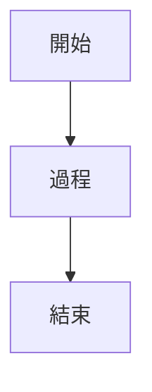

# IELTS 學習筆記 📚

我的 IELTS 考試準備筆記和資源集合，使用 GitHub Pages 建立。

## 🚀 功能特色

- **完整的 IELTS 準備資源**：涵蓋聽力、閱讀、寫作、口說四大技能
- **結構化學習筆記**：策略指南、練習記錄、錯誤分析
- **互動式圖表**：使用 Mermaid 繪製的寫作結構圖
- **響應式設計**：支援各種設備瀏覽

## 📁 專案結構

```
Ielts/
├── 01_Listening/          # 聽力練習
│   ├── error_log.md       # 錯誤記錄
│   └── strategy_notes.md  # 策略筆記
├── 02_Reading/            # 閱讀練習
│   ├── error_log.md       # 錯誤記錄
│   ├── strategy_notes.md  # 策略筆記
│   └── vocabulary.md      # 詞彙庫
├── 03_Writing/            # 寫作練習
│   ├── Task_1/            # 圖表寫作
│   │   ├── 1_strategy/    # 策略指南
│   │   ├── 2_practice_log/# 練習記錄
│   │   └── 3_error_notebook/# 錯誤筆記
│   └── Task_2/            # 議論文寫作
│       ├── 1_strategy/    # 策略指南
│       ├── 2_practice_log/# 練習記錄
│       └── 3_error_notebook/# 錯誤筆記
├── 04_Speaking/           # 口說練習
│   ├── phrases_and_idioms.md    # 短語和慣用語
│   └── topic_practice_log.md   # 話題練習記錄
├── _config.yml            # Jekyll 配置
├── Gemfile                # Ruby 依賴
└── index.md               # 主頁
```

## 🔧 技術設定

### Mermaid 圖表支援

本專案使用 Mermaid 來繪製 IELTS 寫作結構圖。Mermaid 是一個基於 JavaScript 的圖表繪製工具，可以將文字描述轉換為各種圖表。

#### 啟用方式

1. **Jekyll 插件**：已在 `_config.yml` 中啟用 `jekyll-mermaid`
2. **Gemfile**：包含 `jekyll-mermaid` 依賴
3. **自定義樣式**：在 `_includes/head.html` 中配置

#### 使用語法



### 本地開發

```bash
# 安裝依賴
bundle install

# 啟動本地服務器
bundle exec jekyll serve

# 訪問 http://localhost:4000
```

## 📊 學習進度追蹤

### 當前狀態
- **聽力** ✅ 策略制定完成，開始錯誤分析
- **閱讀** ✅ 基礎策略建立，詞彙庫完善
- **寫作 Task 1** ✅ 完整策略體系，持續練習改進
- **寫作 Task 2** 🔄 核心概念建立，論點庫擴充中
- **口說** 🔄 短語庫建立，開始話題練習

### 下階段目標
- 完成所有 Task 2 練習記錄
- 建立完整的錯誤分析體系
- 開始口說 Part 2 和 Part 3 練習
- 進行模擬考試和成績分析

## 🎯 使用指南

### 每日更新流程

1. **練習歸檔**：記錄當天的練習內容
2. **錯誤提煉**：分析並記錄關鍵錯誤
3. **策略更新**：根據新發現更新學習策略

### 學習建議

- 定期複習錯誤筆記
- 使用策略指南規劃練習
- 追蹤學習進度和改進情況

## 🤝 貢獻

歡迎提出建議和改進意見！如果您發現任何問題或有新的想法，請：

1. 開啟 Issue 描述問題
2. 提交 Pull Request 提供改進
3. 分享您的學習心得和技巧

## 📝 授權

本專案採用 MIT 授權條款。詳見 [LICENSE](LICENSE) 檔案。

---

*Remember: Consistent practice and systematic improvement are the keys to IELTS success!* 🎯✨
