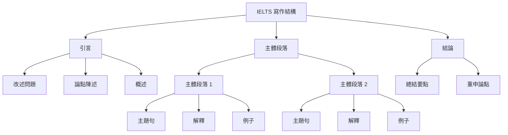

# IELTS Writing Task 2: Key Concepts & Strategies

本指南涵蓋了 IELTS Writing Task 2 高分作文的基本要素，從句子結構到高級寫作技巧。

## I. 文章與句子結構

清晰的結構至關重要。一篇文章應該遵循邏輯進程，使用各種句型來展示語法多樣性。

### 文章結構

一篇標準的高分文章包含四個段落：

#### 引言 (Introduction)

- **改述問題**：用自己的話重述文章問題
- **論點陳述**：清楚表明您的立場或文章將討論的內容
- **概述**：簡要提及您將涵蓋的主要觀點

#### 主體段落 1 (Body Paragraph 1)

- **主題句**：介紹第一個主要觀點
- **解釋**：更詳細地解釋該觀點
- **例子**：提供一個具體例子來支持您的觀點

#### 主體段落 2 (Body Paragraph 2)

- **主題句**：介紹第二個主要觀點
- **解釋**：更詳細地解釋該觀點
- **例子**：提供一個具體例子來支持您的觀點

#### 結論 (Conclusion)

- **總結**：簡要總結您的主要觀點
- **最終意見**：用不同的詞語重申您的論點

### 句子結構

變換句子結構以展示語法靈活性。

#### 複合句 (Compound Sentences)

用連接詞連接兩個獨立分句。

- **連接詞**：for, and, nor, but, or, yet, so (FANBOYS)，以及連接詞如 however, therefore, furthermore
- **例子**：「Many students work part-time, so they often have less time for their studies.」

#### 複雜句 (Complex Sentences)

將一個獨立分句與一個或多個從屬分句結合。

- **例子**：「Many teenagers have a part-time job, which is often poorly paid, to save extra money.」

## II. 高級寫作技巧 (Band 7+)

要獲得更高分數，請融入這些風格和語法特點。

### 模糊限定 (Hedging) ✍️

模糊限定使您的觀點聽起來更學術，不那麼絕對。

#### 方法 1: 頻率副詞

- **詞彙**：often, usually, generally, typically
- **例子**：「Online shopping generally offers more convenience.」

#### 方法 2: 情態動詞

- **詞彙**：might, could, may, should
- **例子**：「Investing in renewable energy could help mitigate climate change.」

#### 方法 3: 引導性短語

- **短語**：It is believed that..., Some argue that..., It could be argued that...
- **例子**：「It could be argued that strict regulations can mitigate social media's negative effects.」

### 被動語態 (Passive Voice) 🏛️

使用被動語態創造更正式、更客觀的語調。

#### 何時使用

- 當動作比行動者更重要時（例如，「New policies were implemented.」）
- 當陳述一般事實或過程時（例如，「It is known that plastic pollutes the oceans.」）
- 當表達一般意見時（例如，「It is often said that travel broadens the mind.」）

## III. 詞彙與連接詞

使用精確的詞彙和流暢的過渡對於在詞彙資源和連貫性方面獲得高分至關重要。

### 話語標記 (連接詞) 🔗

使用這些來引導讀者理解您的論點。避免在每個句子開頭過度使用它們。

- **添加**：Moreover, Furthermore, In addition
- **對比**：However, On the other hand, In contrast
- **結果**：Therefore, Consequently, As a result

### 短語動詞 ✨

使用得當的短語動詞使您的語言聽起來更自然。

- **Bring about**：引起某事發生
- **Carry out**：執行任務
- **Look into**：調查
- **Point out**：指出事實
- **Set out**：清晰地呈現想法

### 特定主題詞彙 🎯

使用與主題相關的精確詞彙展示您的詞彙範圍。

- **環境**：conservation, eco-friendly, endangered species, fossil fuels, global warming
- **教育**：attainment, hands-on experience, vocational training, curriculum, pedagogy
- **技術**：cutting-edge, intuitive design, social media, a technological breakthrough

### 常見概念的同義詞 📚

通過使用關鍵學術術語的同義詞避免重複。

| 概念 | 同義詞 |
|:----:|:------|
| Advantage | Benefit, Merit, Positive Aspect, Upside |
| Disadvantage | Drawback, Shortcoming, Negative Aspect, Downside |
| Cause | Reason, Source, Origin, Factor |
| Effect | Impact, Consequence, Outcome, Ramification |
| Solution | Resolution, Remedy, Answer, Approach |
| Issue | Problem, Challenge, Hurdle, Obstacle |

