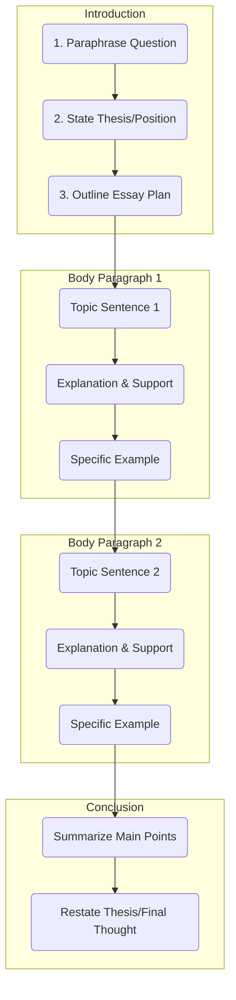

# 雅思寫作 Task 2 程序指南

## 📊 高分解構流程圖

---

## 🏗️ 高分解構框架

這個框架概述了結構良好的四段式論文的必要組成部分。

### 1. 引言 (3 句話)

您的引言應該簡潔，並作為考官的路線圖。

#### 第 1 句：改寫問題

- 用自己的話重新表述論文問題的主要主題

#### 第 2 句：陳述論點

- 清楚呈現您的主要論點或立場
- 對於討論型論文，說明您將檢視兩種觀點

#### 第 3 句：概述計劃

- 簡要提及您主體段落將涵蓋的要點

### 2. 主體段落 (PEEL 方法)

每個主體段落應該專注於一個中心思想，並使用 PEEL 結構充分發展。

#### P - 論點 (主題句)

- 用一句清楚的話陳述段落的主要論點

#### E - 解釋

- 更詳細地解釋您的論點
- 回答「為什麼」或「如何」

#### E - 例子

- 提供具體、相關的例子來支持您的論點
- 例如：個人經驗、新聞或一般知識

#### L - 連結 (可選)

- 總結段落或連結回主要論點的結尾句

### 3. 結論 (2 句話)

結論應該總結您的論文，而不引入新資訊。

#### 第 1 句：總結要點

- 用新的措辭簡要重述您主體段落的主題句

#### 第 2 句：重述論點

- 提供強化您主要論點的最終結論性思考

---

## ⏰ 時間分配建議

**總時間：40 分鐘**

- **規劃階段**：5 分鐘
- **撰寫階段**：30 分鐘
- **檢查階段**：5 分鐘

## 📝 寫作技巧提醒

1. **結構清晰**：確保每個段落都有明確的目的
2. **邏輯流暢**：使用適當的連接詞和過渡句
3. **例子具體**：避免模糊的概括，提供具體的實例
4. **語言多樣**：展示您的語法範圍和詞彙資源
5. **檢查完整**：留出時間檢查拼寫、語法和邏輯
