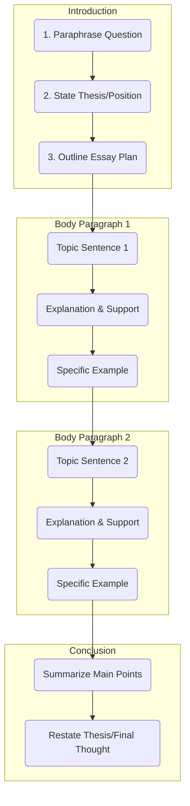
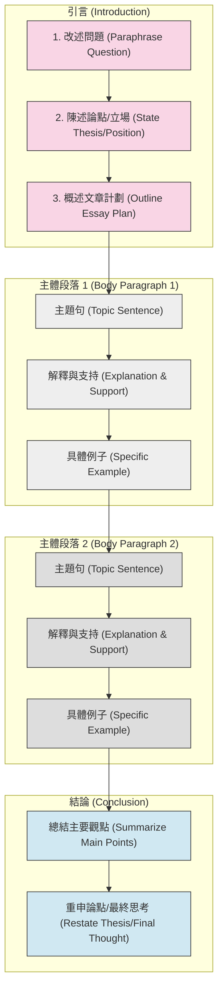

<<<<<<< Updated upstream

High-Scoring Essay Structure

This framework outlines the essential components for a well-structured, four-paragraph essay.

1. Introduction (3 Sentences)

Your introduction should be concise and serve as a roadmap for the examiner.

    Sentence 1: Paraphrase the Question

        Restate the main topic of the essay question in your own words.

    Sentence 2: State Your Thesis

        Clearly present your main argument or position. For discussion essays, state that you will examine both views.

    Sentence 3: Outline Your Plan

        Briefly mention the main points your body paragraphs will cover.

2. Body Paragraphs (PEEL Method)

Each body paragraph should focus on one central idea and develop it fully using the PEEL structure.

    P - Point (Topic Sentence)

        State the main argument of the paragraph in a single, clear sentence.

    E - Explanation

        Explain your point in more detail. Answer "why" or "how."

    E - Example

        Provide a specific, relevant example to support your point (e.g., from personal experience, news, or general knowledge).

    L - Link (Optional)

        A concluding sentence that summarizes the paragraph or links back to the main thesis.

3. Conclusion (2 Sentences)

The conclusion should summarize your essay without introducing new information.

    Sentence 1: Summarize Main Points

        Briefly restate the topic sentences from your body paragraphs in new words.

    Sentence 2: Restate Your Thesis

        Provide a final, concluding thought that reinforces your main argument.
=======
# IELTS Task 2 寫作流程指南

## 文章結構流程圖

## 高分文章結構詳解

本框架概述了一篇結構完善的四段式文章的基本組成部分。

### 1. 引言 (3 句)

您的引言應該簡潔明了，為閱卷人提供文章的路線圖。

#### 第 1 句：改述問題

- 用自己的話重述文章問題的主要主題

#### 第 2 句：陳述您的論點

- 清晰地表明您的主要論點或立場
- 對於討論型文章，說明您將考察雙方觀點

#### 第 3 句：概述您的計劃

- 簡要提及您的主體段落將涵蓋的主要觀點

### 2. 主體段落 (PEEL 方法)

每個主體段落應該專注於一個中心思想，並使用 PEEL 結構充分發展它。

#### P - Point (主題句)

- 在一個清晰的句子中陳述段落的主要論點

#### E - Explanation (解釋)

- 更詳細地解釋您的觀點
- 回答「為什麼」或「如何」

#### E - Example (例子)

- 提供一個具體、相關的例子來支持您的觀點
- 可以來自個人經驗、新聞或一般知識

#### L - Link (連結，可選)

- 總結段落或回扣主論點的結尾句

### 3. 結論 (2 句)

結論應該總結您的文章，而不引入新信息。

#### 第 1 句：總結主要觀點

- 用新的詞語簡要重述主體段落中的主題句

#### 第 2 句：重申您的論點

- 提供一個最終的總結性思考，強化您的主要論點

## 寫作步驟檢查清單

>>>>>>> Stashed changes
