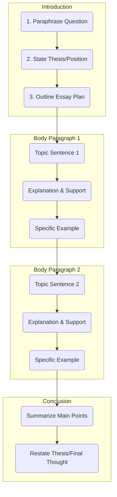

High-Scoring Essay Structure

This framework outlines the essential components for a well-structured, four-paragraph essay.

1. Introduction (3 Sentences)

Your introduction should be concise and serve as a roadmap for the examiner.

    Sentence 1: Paraphrase the Question

        Restate the main topic of the essay question in your own words.

    Sentence 2: State Your Thesis

        Clearly present your main argument or position. For discussion essays, state that you will examine both views.

    Sentence 3: Outline Your Plan

        Briefly mention the main points your body paragraphs will cover.

2. Body Paragraphs (PEEL Method)

Each body paragraph should focus on one central idea and develop it fully using the PEEL structure.

    P - Point (Topic Sentence)

        State the main argument of the paragraph in a single, clear sentence.

    E - Explanation

        Explain your point in more detail. Answer "why" or "how."

    E - Example

        Provide a specific, relevant example to support your point (e.g., from personal experience, news, or general knowledge).

    L - Link (Optional)

        A concluding sentence that summarizes the paragraph or links back to the main thesis.

3. Conclusion (2 Sentences)

The conclusion should summarize your essay without introducing new information.

    Sentence 1: Summarize Main Points

        Briefly restate the topic sentences from your body paragraphs in new words.

    Sentence 2: Restate Your Thesis

        Provide a final, concluding thought that reinforces your main argument.
